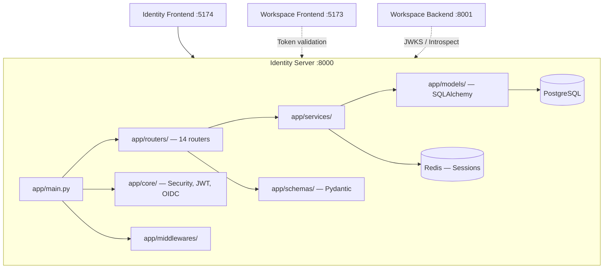
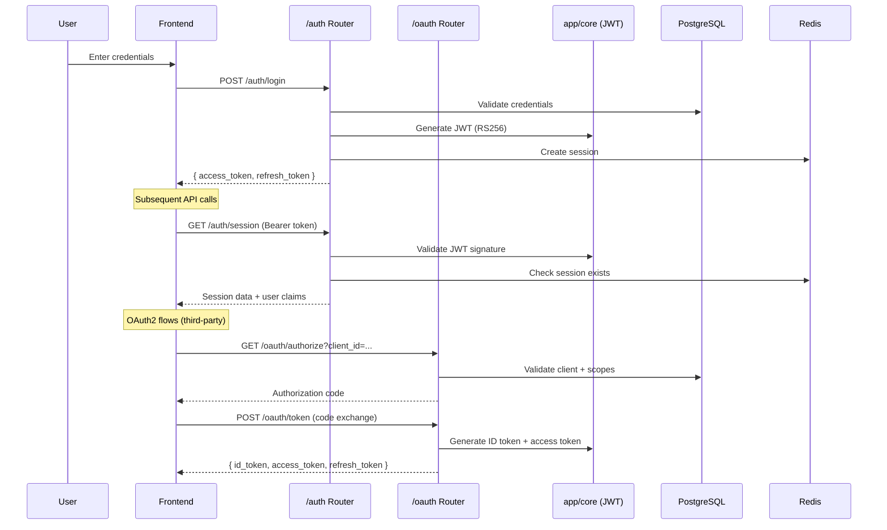

# Identity Auth Provider

The Identity Server is the **security backbone** of the SaaS platform. It handles all authentication, authorization, OAuth2/OIDC, RBAC, and multi-tenant organization management.

---

## Architecture



- **Path**: `apps/identity_server/backend`
- **Port**: `8000`
- **Entrypoint**: `app.main:app`
- **Database**: PostgreSQL (SQLAlchemy + Alembic)
- **Cache/Sessions**: Redis
- **Package manager**: `uv`

---

## Directory Structure

```text
apps/identity_server/backend/
├── app/
│   ├── main.py                  # FastAPI entry: middleware, CORS, router mounts
│   ├── config.py                # Environment vars, settings
│   ├── api/                     # API utilities
│   ├── core/                    # ★ Security: JWT signing, OAuth2, OIDC, JWKS
│   ├── db/                      # PostgreSQL session pool, connection management
│   ├── middlewares/             # Auth middleware, request logging, rate limiting
│   ├── models/                  # SQLAlchemy ORM models (User, Org, Role, etc.)
│   ├── routers/                 # ★ All 14 API route handlers
│   ├── schemas/                 # Pydantic request/response schemas
│   ├── services/                # Business logic layer
│   └── templates/               # Jinja2 email templates
├── alembic/                     # PostgreSQL migration scripts
│   └── versions/                # Migration history
├── setup/                       # DB seeding (seed_defaults.py), bootstrap scripts
├── tests/                       # API and unit tests
├── keys/                        # JWT RS256 signing keys (private + public)
└── logs/                        # Runtime log output
```

---

## Router Inventory (14 routers)

### Authentication & OAuth
| Router | File | Key Endpoints | Security Level |
|:---|:---|:---|:---|
| **auth** | `routers/auth.py` | `POST /login`, `POST /logout`, `GET /session`, token refresh | Critical |
| **oauth** | `routers/oauth.py` | `/authorize`, `/token`, `/introspect`, `/revoke`, `/.well-known/openid-configuration`, `/jwks` | Critical |
| **client** | `routers/client.py` | OAuth client CRUD (create, list, delete) | High |
| **webhooks** | `routers/webhooks.py` | Webhook event handlers | Medium |

### Organization & Multi-Tenancy
| Router | File | Key Endpoints | Security Level |
|:---|:---|:---|:---|
| **organization_registration** | `routers/organization_registration.py` | Org signup, onboarding, provisioning | High |
| **organization_rbac** | `routers/organization_rbac.py` | Roles CRUD, permissions assignment per org | High |
| **organization_users** | `routers/organization_users.py` | User invites, member management | Medium |

### Platform Administration
| Router | File | Key Endpoints | Security Level |
|:---|:---|:---|:---|
| **platform** | `routers/platform.py` | Platform-wide CRUD (orgs, users, features, SaaS apps) | Critical |
| **policy_management** | `routers/policy_management.py` | PBAC policy CRUD | High |
| **apps** | `routers/apps.py` | SaaS app registration, feature flags | High |
| **plans** | `routers/plans.py` | Subscription plan definitions | Medium |
| **payment** | `routers/payment.py` | Payment processing, billing | High |

### System
| Router | File | Key Endpoints | Security Level |
|:---|:---|:---|:---|
| **health** | `routers/health.py` | Health checks, readiness probes | Low |
| **logs** | `routers/logs.py` | Log retrieval, diagnostics | Low |

---

## Authentication Flow



---

## Key Security Patterns

- **JWT RS256**: Tokens signed with RSA private key from `keys/`. Public key exposed via `/jwks`
- **Session deduplication**: Redis prevents redundant sessions per user-device pair
- **PBAC (Policy-Based Access Control)**: Policies define granular permissions per org/role/resource
- **OIDC compliance**: Standard claims (`sub`, `aud`, `iss`), discovery endpoint, JWKS
- **Audience strategy**: First-party tokens use identity server audience, third-party use client-specific audience
- **Rate limiting**: Redis-backed middleware for login attempt throttling

---

## Layered Architecture Pattern

```text
Router (routers/*.py)       → HTTP layer: request parsing, response formatting
    ↓
Service (services/*.py)     → Business logic: rules, validation, orchestration
    ↓
Model (models/*.py)         → SQLAlchemy ORM: database entities
    ↓
DB (db/)                    → PostgreSQL session management, connection pool
```

---

## How to Add Features

### New Router
1. Create `app/routers/{feature}.py` with `APIRouter`
2. Create `app/schemas/{feature}.py` for Pydantic models
3. Create `app/services/{feature}.py` for business logic
4. Create `app/models/{feature}.py` for SQLAlchemy models (if new tables)
5. Mount router in `app/main.py`
6. Migration: `uv run alembic revision --autogenerate -m "add {feature}"`
7. Apply: `uv run alembic upgrade head`

### New RBAC Permission
1. Add permission string to the seeding script in `setup/seed_defaults.py`
2. Reference in router via PBAC guard or dependency injection

---

## Validate

```powershell
cd apps\identity_server\backend
uv sync
uv run uvicorn app.main:app --port 8000 --reload
uv run pytest tests/ -v   # when tests exist
```
