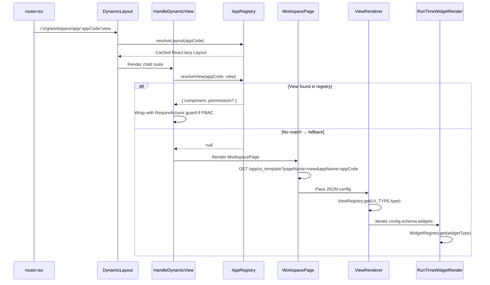

# React Frontend UI Skill
You are responsible for generating production-quality React code for a fullstack React + FastAPI application.
Your goal is to build clean, maintainable, and well-structured UI code that integrates seamlessly with a FastAPI backend and follows modern React best practices.
Both React frontends share a common rendering engine that combines:

Static registry-based routing
Dynamic, config-driven UI templates provided by the backend

Both React frontends share an identical rendering engine that combines **static registry-based** routing with **dynamic config-driven** templates from the backend.

---
## Performance Guidelines

Prevent unnecessary re-renders
Use React.memo for all reusable components
Use useCallback for event handlers
Use useMemo for computed values and stable objects
Avoid inline object/array/function creation inside JSX
Use lazy loading (React.lazy, Suspense) for heavy components
Use stable keys when rendering lists

## Rendering Pipeline


### UI Rendering Flow

### Phase 1 — Route Matching
URL `/:organization_name/workspace/app/:appCode/:view` hits `router.tsx`:
1. **`DynamicLayout`** (`src/utils/app/DynamicLayout.tsx`) resolves the layout shell via `AppRegistry.resolveLayout()`
2. **`HandleDynamicView`** (`src/utils/app/HandleDynamicView.tsx`) resolves the view content via `AppRegistry.resolveView()`

### Phase 2 — Component Resolution (AppRegistry)
`AppRegistry` (`src/core/registry/AppRegistry.ts`) is the **central source of truth**:
- `resolveView(appName, viewName)` → cached `React.lazy` component + optional PBAC permissions
- `resolveLayout(appName)` → cached layout component
- `resolveWorkspacePage()` → fallback to config-driven rendering
- Internal `lazyCache` Map prevents unmount/remount on re-renders

### Phase 3 — Config-Driven Templates (WorkspacePage)
When `AppRegistry` returns `null`, **`WorkspacePage`** (`src/core/WorkspacePage.tsx`) takes over:
1. Calls `GET /app/ui_template?pageName={viewName}&appName={appCode}` on workspace backend
2. Backend returns JSON: `UI_TYPE` (view type) + `UI_VIEW.schema.config` (widget array) + `scriptFiles`

### Phase 4 — Runtime Rendering
JSON config renders through a chain of registries:
1. **`ViewRenderer`** → resolves `UI_TYPE.type` via `ViewRegistry` → dispatches to a view component
2. **View component** (SectionView, FormView, etc.) iterates config array
3. **`RunTimeWidgetRender`** → resolves each widget via `WidgetRegistry`
4. **`UITypeRegistry`** → handles section-level types (KPI, TABLE, CHART, ACTION)

---

## Frontends

| Frontend | Path | Port | Domain |
|:---|:---|:---|:---|
| **Identity** | `apps/identity_server/web` | `5174` | Auth, RBAC, orgs, OAuth management, platform admin |
| **Workspace** | `apps/work_space/web` | `5173` | Workspace UI, app rendering, feature modules, dynamic views |

---

## Core Directory Structure (`src/`)

```text
src/
├── router.tsx                    # Route definitions (React Router v7)
├── main.tsx                      # App bootstrap with ChakraProvider
├── core/                         # ★ Rendering Engine
│   ├── registry/
│   │   ├── AppRegistry.ts        # appName+viewName → lazy component + PBAC
│   │   ├── ViewRegistry.ts       # ViewType enum → view renderer
│   │   ├── WidgetRegistry.ts     # Widget type string → widget component
│   │   ├── UITypeRegistry.ts     # Section type → section renderer
│   │   ├── UISectionType.ts      # Section type enum + aliases
│   │   └── AppEventRegistry.ts   # Cross-widget event bus
│   ├── renderer/
│   │   ├── ViewRenderer.tsx      # Dispatches to ViewRegistry
│   │   ├── RunTimeWidget.tsx     # Recursive widget renderer
│   │   ├── UIEngine.tsx          # Higher-level rendering orchestrator
│   │   ├── UITypeRenderEntry.tsx # Entry for UIType section renderers
│   │   ├── DialogRenderer.tsx    # Dialog/modal rendering
│   │   ├── FallbackRenderer.tsx  # Error/not-found fallback UI
│   │   └── ui-type-renderers/    # KPI, Table, Chart, Action renderers
│   ├── action-engine/
│   │   ├── ActionEngine.ts       # Executes actions (API calls, nav, submit)
│   │   └── types.ts              # Action type definitions
│   ├── rule-engine/              # Conditional visibility/validation rules
│   ├── widgets/                  # All registered widget components
│   │   ├── index.ts              # ★ Widget registration entry point
│   │   ├── TextField.tsx, SelectField.tsx, TabsWidget.tsx, TableWidget.tsx ...
│   │   └── WidgetUIBuilder.tsx   # Form context setup (react-hook-form)
│   ├── views/
│   │   ├── index.ts              # ★ View registration entry point
│   │   ├── SectionView.tsx, FormView.tsx, GridView.tsx, PageView.tsx
│   ├── WorkspacePage.tsx          # Config-driven page (API template fallback)
│   ├── guards/                   # RouterGuard, RequireAccess (PBAC)
│   ├── store/                    # useFormStore (Zustand)
│   └── hooks/                    # Core hooks
├── features/
│   ├── auth/                     # Login, signup, forgot-password, callback
│   ├── modules/                  # App-specific modules
│   │   ├── system/               # Platform admin views (14+ views)
│   │   └── gym/                  # Gym domain views (example tenant module)
│   ├── myApps/                   # App launcher
│   ├── policy-management/        # RBAC policy management UI
│   └── ui/                       # Shared UI (Loader, etc.)
├── utils/app/                    # HandleDynamicView, DynamicLayout
├── contexts/                     # AuthContext, PrivateRoute
├── components/                   # Shared Chakra UI components
├── theme/layouts/                # auth/ and workspace/ layout shells
├── config/                       # App configuration
├── app/                          # API client (GETAPI, POSTAPI — RxJS)
└── DB_CONFIG/                    # JSON templates (APP_CONFIG, TEMPLATE)
```

---

## All Registries

### WidgetRegistry (15 widgets)

| Key | Component | File |
|:---|:---|:---|
| `textField` | TextField | `core/widgets/TextField.tsx` |
| `selectField` | SelectField | `core/widgets/SelectField.tsx` |
| `radioField` | RadioField | `core/widgets/RadioField.tsx` |
| `textAreaField` | TextArea | `core/widgets/TextArea.tsx` |
| `switchField` | SwitchField | `core/widgets/SwitchField.tsx` |
| `dateField` | DateField | `core/widgets/DateField.tsx` |
| `dateAndTimeField` | DateTimeField | `core/widgets/DateTimeField.tsx` |
| `uploadField` | UploadField | `core/widgets/UploadField.tsx` |
| `panel` | CollapsiblePanel | `core/widgets/Panel.tsx` |
| `grid` | Grid | `core/widgets/Grid.tsx` |
| `stepper` | StepperWidget | `core/widgets/Stepper.tsx` |
| `kpi` | KPITile | `core/widgets/KPITile.tsx` |
| `kpiTable` | KPITable | `core/widgets/KPITable.tsx` |
| `tabs` | TabsWidget | `core/widgets/TabsWidget.tsx` |
| `cardGrid` | CardGrid | `core/widgets/CardGrid.tsx` |

Register new widgets in `core/widgets/index.ts`.

### ViewRegistry (4 view types)

| ViewType | Component |
|:---|:---|
| `SECTION_VIEW` | SectionView |
| `FORM_VIEW` | FormView |
| `GRID_VIEW` | GridView |
| `PAGE_VIEW` | PageView |

### UITypeRegistry (4 section renderers)

| Section | Renderer |
|:---|:---|
| `KPI_SECTION` | KPISectionRenderer |
| `TABLE_SECTION` | TableSectionRenderer |
| `CHART_SECTION` | ChartSectionRenderer |
| `ACTION_SECTION` | ActionSectionRenderer |

### AppRegistry (registered apps)

| App | Views |
|:---|:---|
| `system` | home, DatabaseStatistics, ApplicationClients, AuthUsers, Organizations, accesscontrol, SaasApps, Features, Permissions, SubscriptionPlans, OrganizationRoles, OrganizationUsers, OrganizationAccess, PolicyManagement |
| `myGym` | home, Subscription, ListMember, GymSubscriptionPlans, AddSubscriptionPlan, CreateSubscription |
| `Default` | workspacePage (fallback), myApps, pageNotFound |

---

## Route Tree (Workspace Frontend)

```text
/                                    → Redirect to /auth
/auth/login                          → SignIn
/auth/sign-up                        → SignUp
/auth/forgot-password                → ForgotPassword
/auth/callback                       → OAuth callback
/:org/workspace/                     → DynamicLayout + HandleDynamicView
/:org/workspace/profile              → WorkspaceProfilePage
/:org/workspace/settings             → WorkspaceSettingsPage
/:org/workspace/helpcenter           → WorkspaceHelpCenterPage
/:org/workspace/app/:appCode/:view   → AppRegistry → Component or WorkspacePage
/:org/workspace/:view                → AppRegistry (no appCode)
/myApps                              → MyApps launcher
/unauthorized                        → UnauthorizedAccess
*                                    → PageNotFound
```

---

## How to Add New Features

### New App Module
1. Create `src/features/modules/{appName}/` with view components
2. Register in `AppRegistry.ts`: `{ viewName: () => import("@/features/modules/{appName}/ViewComponent") }`
3. Add PBAC: `{ component: () => import(...), permissions: "ROLE.SCOPE.*" }`

### New Widget
1. Create `src/core/widgets/{WidgetName}.tsx`
2. Register in `src/core/widgets/index.ts`: `WidgetRegistry.register('key', Component)`

### New View Type
1. Create `src/core/views/{ViewName}.tsx`
2. Register in `src/core/views/index.ts`: `ViewRegistry.register(ViewType.NEW_TYPE, Component)`

---

## Backend API Awareness

| API | Backend | Purpose |
|:---|:---|:---|
| `GET /app/ui_template?pageName=X&appName=Y` | Workspace `:8001` | Fetch JSON UI template |
| `POST /auth/login` | Identity `:8000` | User authentication |
| `GET /auth/session` | Identity `:8000` | Session validation |
| `GET /oauth/authorize` | Identity `:8000` | OAuth2 authorization |
| `POST /oauth/token` | Identity `:8000` | Token exchange |
| `GET /platform/*` | Identity `:8000` | Platform admin data |
| `GET /organization/*` | Identity `:8000` | Organization RBAC |

---

## Tech Stack
- React + TypeScript (strict) + Vite
- Chakra UI v3 — design system
- React Router v7 — routing
- React Hook Form — via `WidgetUIBuilder`
- Zustand — `useFormStore`
- RxJS — API layer (`GETAPI`, `POSTAPI`)

## Workflow
1. Identify frontend: identity vs workspace
2. Check if page is **registry-based** (`AppRegistry`) or **config-driven** (`WorkspacePage`)
3. Read nearest registry/view/widget before editing
4. Use `WidgetRegistry` for new form fields, `AppRegistry` for new pages
5. Validate: `npm run dev` in the app directory
