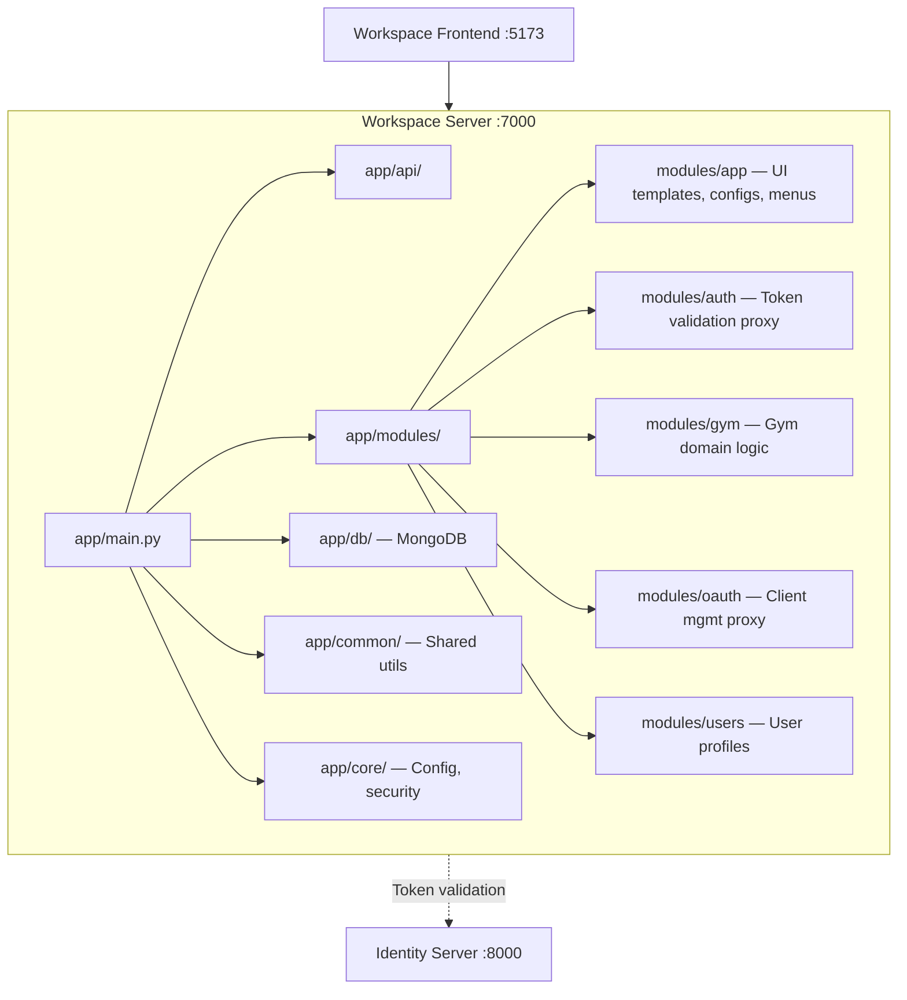
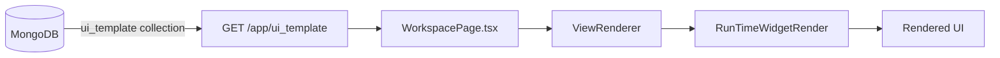

# Workspace API Engine

The Workspace Backend serves the **business logic layer** — dynamic UI templates, app module APIs, domain features (gym, etc.), and MongoDB-backed data for the workspace frontend.

---

## Architecture



- **Path**: `apps/work_space/backend`
- **Port**: `7000`
- **Entrypoint**: `app.main:app`
- **Database**: MongoDB
- **Package manager**: `uv`

---

## Directory Structure

```text
apps/work_space/backend/
├── app/
│   ├── main.py                  # FastAPI entry, module router registration
│   ├── api/                     # API utilities, shared middleware
│   ├── common/                  # Shared utils, helpers, constants
│   ├── core/                    # Configuration, security settings
│   ├── db/                      # MongoDB connection, collection management
│   └── modules/                 # ★ Feature-based module structure
│       ├── app/                 # UI templates, app configs, menu data
│       ├── auth/                # Token validation (delegates to identity server)
│       ├── gym/                 # Gym domain (members, subscriptions, plans)
│       ├── oauth/               # OAuth client management (proxy to identity)
│       └── users/               # User profiles, preferences
├── storage/                     # Uploaded files, generated assets
└── logs/                        # Runtime logs
```

---

## Module Architecture

Each module follows a consistent internal structure:

```text
modules/{module_name}/
├── router.py          # FastAPI APIRouter with endpoints
├── service.py         # Business logic layer
├── schema.py          # Pydantic request/response schemas
├── model.py           # MongoDB document models (optional)
└── utils.py           # Module-specific helpers (optional)
```

### Module Inventory

| Module | Purpose | Key APIs |
|:---|:---|:---|
| **app** | Dynamic UI config | `GET /app/ui_template`, app config CRUD, sidebar menus |
| **auth** | Auth proxy | Token validation (delegates to identity server JWKS) |
| **gym** | Gym domain | Members CRUD, subscription plans, enrollment |
| **oauth** | OAuth proxy | Client management (proxies to identity server) |
| **users** | User profiles | Profile CRUD, preferences, user directory |

---

## Critical API: UI Templates

The workspace backend serves the **config-driven UI templates** consumed by the frontend's `WorkspacePage`:

```
GET /app/ui_template?pageName={viewName}&appName={appCode}
```

### Response Structure
```json
{
  "UI_TYPE": { "type": "FORM_VIEW" },
  "UI_VIEW": {
    "schema": {
      "config": [
        { "type": "textField", "name": "firstName", "label": "First Name" },
        { "type": "selectField", "name": "role", "label": "Role" }
      ]
    }
  },
  "scriptFiles": []
}
```

### Template Flow


Templates are stored per-tenant in MongoDB, enabling **multi-tenant UI customization** without code changes.

---

## Cross-Service Integration

The workspace backend **delegates authentication** to the identity server:

| What | How |
|:---|:---|
| Token validation | JWKS endpoint or `/oauth/introspect` on identity server `:8000` |
| User identity | JWT claims (`sub`, `org_id`, `permissions`) |
| Session check | Proxy to identity `/auth/session` when needed |

---

## How to Add Features

### New Module
1. Create `app/modules/{module_name}/` directory
2. Add `router.py` with FastAPI `APIRouter`
3. Add `service.py` for business logic
4. Add `schema.py` for Pydantic models
5. Register router in `app/main.py`
6. Add MongoDB collection setup in `app/db/` if needed

### New UI Template
1. Create a JSON template following the `UI_TYPE` + `UI_VIEW.schema.config` format
2. Store in MongoDB's `ui_template` collection
3. Reference from `DB_CONFIG/TEMPLATE/` for development/testing
4. The frontend's `WorkspacePage` will auto-render it

---

## Validate

```powershell
cd apps\work_space\backend
uv sync
uv run uvicorn app.main:app --port 7000 --reload
```
