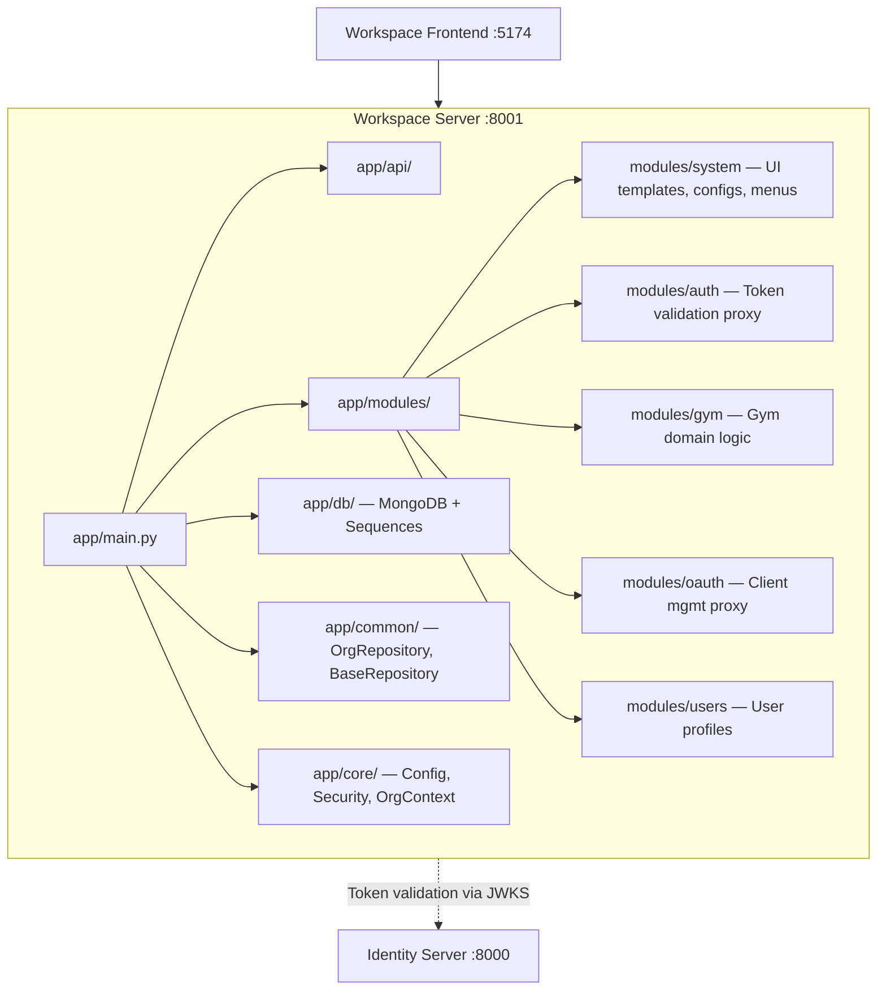
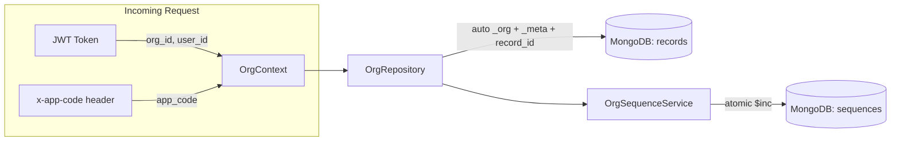
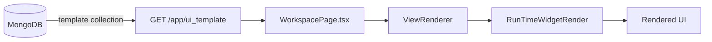

# Workspace API Engine

The Workspace Backend serves the **business logic layer** — dynamic UI templates, app module APIs, domain features (gym, etc.), and MongoDB-backed data for the workspace frontend.

---

## Architecture



- **Path**: `apps/work_space/backend`
- **Port**: `8001`
- **Entrypoint**: `app.main:app`
- **Database**: MongoDB (Motor async driver)
- **Package manager**: `uv`

---

## Directory Structure

```text
apps/work_space/backend/
├── app/
│   ├── main.py                       # FastAPI entry, lifespan, middleware
│   ├── api/                          # API utilities, shared middleware
│   ├── common/
│   │   ├── repository.py             # BaseRepository (system-level collections)
│   │   ├── org_repository.py         # ★ OrgRepository (org-scoped CRUD with audit)
│   │   └── service.py                # BaseService
│   ├── core/
│   │   ├── config.py                 # Settings (pydantic-settings)
│   │   ├── context.py                # ★ OrgContext + get_org_context dependency
│   │   ├── errors.py                 # ApiError
│   │   ├── logger.py                 # Structured logging
│   │   ├── responses.py              # Response helpers
│   │   ├── oauth2_client.py          # OAuth2 token validation client
│   │   ├── security/
│   │   │   └── authentications.py    # get_authenticated_identity (JWT)
│   │   └── middlewares/
│   │       ├── auth_middleware.py     # Auth middleware
│   │       ├── security_middleware.py # X-headers → request.state.security_headers
│   │       └── loggerMiddleware.py    # Request logging
│   ├── db/
│   │   ├── database.py               # MongoDB connection + index creation
│   │   ├── sequence.py               # Legacy sequence (deprecated)
│   │   └── org_sequence.py           # ★ OrgSequenceService (org-scoped)
│   └── modules/
│       ├── system/                   # UI templates, app configs, menu data
│       ├── auth/                     # Token validation (delegates to identity)
│       ├── gym/                      # Gym domain (members, subscriptions)
│       ├── oauth/                    # OAuth client management proxy
│       └── users/                    # User profiles, preferences
├── storage/                          # Uploaded files
└── logs/                             # Runtime logs
```

---

## ★ Unified Org Data Layer

This is the **core architectural pattern** for all data operations. Every piece of business data is stored in a single `records` collection with org isolation, automatic audit trails, and auto-generated IDs.

### Data Flow



### OrgContext (`app/core/context.py`)

The **single source of truth** for "who is making this request". Extracted from JWT + security headers — **never from the request body**.

```python
@dataclass(frozen=True, slots=True)
class OrgContext:
    # Organization (from JWT)
    org_id: int
    org_uuid: str
    org_name: str

    # User (from JWT)
    user_id: str          # sub claim
    user_name: str
    user_type: str

    # App (from x-app-code header)
    app_code: str         # e.g. "myGym"
    app_name: str         # display name
    subscribed_apps: list  # JWT subscribed_apps claim
```

**Key methods:**
| Method | Returns | Used by |
|:---|:---|:---|
| `to_org_block()` | `_org` dict for document | `OrgRepository.insert_one()` |
| `to_created_meta(entity_type, record_id)` | `_meta` dict for new doc | `OrgRepository.insert_one()` |
| `to_update_meta()` | `$set` dict for update audit | `OrgRepository.update_one()` |
| `to_delete_meta()` | `$set` dict for soft-delete | `OrgRepository.soft_delete()` |
| `org_filter` (property) | `{"_org.org_id": N}` | All read queries |
| `active_filter` (property) | org + `is_deleted: false` | Default read filter |

**FastAPI dependency:**
```python
from app.core.context import OrgContext, get_org_context

@router.post("/members")
async def add_member(ctx: OrgContext = Depends(get_org_context)):
    # ctx.org_id    → 5 (from JWT)
    # ctx.app_code  → "myGym" (from x-app-code header)
    # ctx.user_id   → "john_doe" (from JWT sub)
```

**Source mapping:**
| OrgContext field | Source | Header/Claim |
|:---|:---|:---|
| `org_id` | JWT | `organization_id` |
| `org_uuid` | JWT | `organization_uuid` |
| `org_name` | JWT | `organization_name` |
| `user_id` | JWT | `sub` |
| `user_name` | JWT | `username` |
| `user_type` | JWT | `userType` |
| `app_code` | HTTP header | `x-app-code` |
| `subscribed_apps` | JWT | `subscribed_apps` |

---

### Document Structure (MongoDB `records` collection)

Every document in the `records` collection follows this exact structure:

```json
{
  "_id": "ObjectId(...)",

  "_org": {
    "org_id": 5,
    "org_uuid": "abc-123-def-456",
    "org_name": "FitZone Gym",
    "app_code": "myGym",
    "app_name": "myGym"
  },

  "_meta": {
    "entity_type": "member",
    "record_id": "MYGYM-202604-0001",
    "version": 1,
    "is_deleted": false,
    "created": {
      "at": "2026-04-04T21:30:00Z",
      "by": "john_doe"
    },
    "updated": {
      "at": "2026-04-04T22:00:00Z",
      "by": "admin_user"
    },
    "deleted": null
  },

  "data": {
    "firstName": "Alice",
    "lastName": "Smith",
    "member_id": "M-1",
    "phone": "9876543210"
  }
}
```

**Block rules:**

| Block | Mutability | Purpose |
|:---|:---|:---|
| `_org` | **Immutable after insert** | Records which org/app created this |
| `_meta` | **System-managed only** | Audit trail, versioning, soft-delete |
| `data` | **Mutable via update** | Business data (dynamic, any fields) |

**On update:** `_meta.updated.at/by` is set, `_meta.version` incremented.

**On soft-delete:**
```json
"_meta.is_deleted": true,
"_meta.deleted": { "at": "...", "by": "admin_user" }
```

**Timestamps:** Stored as native UTC `datetime` objects (BSON Date, 8 bytes). Supports range queries, sorting, TTL indexes natively.

---

### OrgRepository (`app/common/org_repository.py`)

Org-scoped MongoDB repository. **Every query is automatically filtered by `_org.org_id`**.

```python
from app.common.org_repository import OrgRepository

repo = OrgRepository(db, "records", ctx)
```

**CRUD Methods:**

| Method | What it does |
|:---|:---|
| `insert_one(data, entity_type, prefix)` | Insert with auto `_org` + `_meta` + `record_id` |
| `find(query, sort, skip, limit)` | Org-scoped list (excludes soft-deleted by default) |
| `find_one(query)` | Org-scoped single lookup |
| `count(query)` | Org-scoped count |
| `update_one(query, update_data)` | Update `data.*` fields + auto audit stamps |
| `soft_delete(query)` | Set `is_deleted=true` + `deleted.at/by` |
| `hard_delete(query)` | Permanent removal (GDPR use only) |

**Auto-generated `record_id`:** On every `insert_one()`, OrgSequenceService automatically generates a monthly-reset ID like `MYGYM-202604-0001`. No manual call needed.

---

### OrgSequenceService (`app/db/org_sequence.py`)

Atomic, org-scoped sequence generator using MongoDB `$inc`.

```python
from app.db.org_sequence import OrgSequenceService

seq = OrgSequenceService(db, ctx)

# Monthly-reset: MYGYM-202604-0001
await seq.monthly("member", prefix="MYGYM")

# Continuous: M-1, M-2, M-3
await seq.simple("member", prefix="M")
```

Counter keys are namespaced: `{org_name}:{app_code}:{entity}:{month}` — prevents cross-org collisions.

---

### Data Sanitizer (`app/modules/gym/schemas.py`)

Since forms are **config-driven** (dynamic fields), there are no rigid Pydantic schemas. Instead, a sanitizer protects against:

| Threat | Protection |
|:---|:---|
| XSS / `<script>` injection | Strips script tags, `javascript:`, event handlers |
| MongoDB operator injection | Drops keys starting with `$` |
| System field tampering | Drops keys starting with `_` |
| Payload bombs | Max 5 depth, 200 keys, 5000 chars/string |

```python
from app.modules.gym.schemas import sanitize_payload

raw = await request.json()
clean = sanitize_payload(raw)  # safe for MongoDB insertion
```

---

### MongoDB Indexes (`app/db/database.py`)

Created automatically at startup via `_ensure_indexes()`:

```python
# Compound: org + entity type + created date (covers 95% of reads)
("_org.org_id", 1), ("_meta.entity_type", 1), ("_meta.created.at", -1)

# Unique record_id per org
("_org.org_id", 1), ("_meta.record_id", 1)  # unique=True

# Soft-delete filter
("_org.org_id", 1), ("_meta.is_deleted", 1)
```

---

## Module Architecture

Each module follows a consistent internal structure:

```text
modules/{module_name}/
├── router.py          # FastAPI APIRouter with endpoints
├── schemas.py         # Sanitizer or Pydantic models
├── service.py         # Business logic layer (optional)
├── repository.py      # Custom repository (optional, or use OrgRepository)
├── dependencies.py    # FastAPI Depends wiring (optional)
└── utils.py           # Module-specific helpers (optional)
```

### Module Inventory

| Module | Purpose | Key APIs |
|:---|:---|:---|
| **system** | Dynamic UI config | `GET /app/ui_template`, app config CRUD, sidebar menus |
| **auth** | Auth proxy | Token validation (delegates to identity server JWKS) |
| **gym** | Gym domain | Members CRUD via OrgRepository |
| **oauth** | OAuth proxy | Client management (proxies to identity server) |
| **users** | User profiles | Profile CRUD, preferences |

---

## Critical API: UI Templates

The workspace backend serves **config-driven UI templates** consumed by the frontend's `WorkspacePage`:

```
GET /app/ui_template?pageName={viewName}&appName={appCode}
```

### Template Flow


---

## Cross-Service Integration

The workspace backend **delegates authentication** to the identity server:

| What | How |
|:---|:---|
| Token validation | JWKS endpoint on identity server `:8000` |
| User identity | JWT claims (`sub`, `organization_id`, `permissions`, `subscribed_apps`) |
| App context | `x-app-code` header from frontend |
| Org isolation | `OrgContext` auto-filters all queries |

---

## How to Add Features

### New Module with Org-Scoped Data

```python
# 1. Create app/modules/{name}/router.py
from fastapi import APIRouter, Depends, Request
from app.core.context import OrgContext, get_org_context
from app.common.org_repository import OrgRepository
from app.db.database import get_database
from app.modules.{name}.schemas import sanitize_payload

router = APIRouter(dependencies=[Depends(get_authenticated_identity)])

@router.post("/create")
async def create_item(
    request: Request,
    ctx: OrgContext = Depends(get_org_context),
    db=Depends(get_database),
):
    raw = await request.json()
    data = sanitize_payload(raw)

    repo = OrgRepository(db, "records", ctx)
    doc = await repo.insert_one(
        data=data,
        entity_type="invoice",
        prefix=ctx.app_code.upper(),  # → ACCOUNTING-202604-0001
    )
    return {"success": True, "data": doc}
```

**That's it.** Org isolation, audit trail, record_id generation, and data sanitization are all automatic.

### New UI Template
1. Create a JSON template following the `UI_TYPE` + `UI_VIEW.schema.config` format
2. Store in MongoDB's `template` collection
3. Reference from `DB_CONFIG/TEMPLATE/` for development/testing
4. The frontend's `WorkspacePage` will auto-render it

---

## Validate

```powershell
cd apps\work_space\backend
uv sync
uv run uvicorn app.main:app --port 8001 --reload
```
