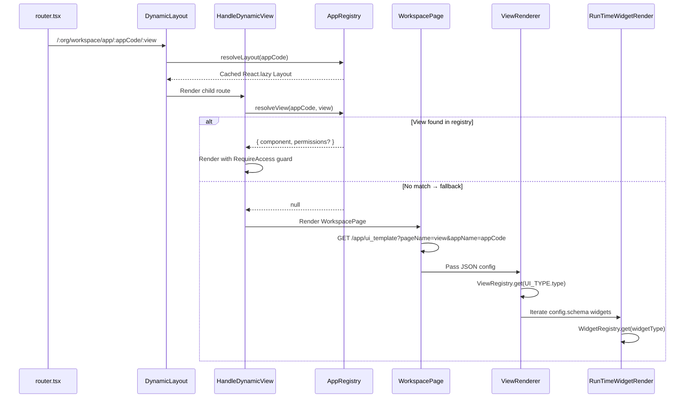

# UI Configuration & Rendering Architecture

This document explains how **`apps/identity_server/web`** and **`apps/work_space/web`** render their UI dynamically through registries and database-driven configuration.

Both frontends share the same architectural patterns and core rendering logic located in `src/core` and `src/utils/app`.

---

## Rendering Pipeline



---

## Phase-by-Phase Breakdown

### Phase 1: Route Matching
When a user navigates to a URL like `/:organization_name/workspace/app/:appCode/:view`:
1. **`DynamicLayout`** (`src/utils/app/DynamicLayout.tsx`) — resolves the layout shell via `AppRegistry.resolveLayout()`
2. **`HandleDynamicView`** (`src/utils/app/HandleDynamicView.tsx`) — resolves the view content via `AppRegistry.resolveView()`

### Phase 2: Component Resolution (AppRegistry)
`AppRegistry` (`src/core/registry/AppRegistry.ts`) is the central registry mapping route parameters to React components:
- **`resolveLayout(appName)`** → lazy-loaded layout component
- **`resolveView(appName, viewName)`** → lazy-loaded view + optional PBAC permissions
- **`resolveWorkspacePage()`** → fallback to config-driven rendering
- Components are created via `React.lazy` and cached in a `Map` to prevent remounts

### Phase 3: Fallback to Config-Driven Templates (WorkspacePage)
If `AppRegistry.resolveView()` returns `null`, it falls back to **`WorkspacePage`** (`src/core/WorkspacePage.tsx`):
1. **API Call**: `GET /app/ui_template?pageName={viewName}&appName={appCode}`
2. **Template Response**: JSON with `UI_TYPE`, `UI_VIEW.schema.config` (widget array), and `scriptFiles`

### Phase 4: Runtime Rendering
The JSON config is rendered through a chain of registries:
1. **`ViewRenderer`** (`src/core/renderer/ViewRenderer.tsx`) — resolves `UI_TYPE.type` via `ViewRegistry`
2. **`ViewRegistry`** — maps to view components: `SECTION_VIEW`, `FORM_VIEW`, `GRID_VIEW`, `PAGE_VIEW`
3. **View component** iterates the `config` array and passes each item to `RunTimeWidgetRender`
4. **`RunTimeWidgetRender`** (`src/core/renderer/RunTimeWidget.tsx`) — resolves each widget type via `WidgetRegistry`
5. **`UITypeRegistry`** — handles section-level types: `KPI_SECTION`, `TABLE_SECTION`, `CHART_SECTION`, `ACTION_SECTION`

---

## Key File Locations

| Component | Path (relative to `src/`) | Responsibility |
|:---|:---|:---|
| **AppRegistry** | `core/registry/AppRegistry.ts` | Maps app/view strings to lazy components + PBAC |
| **WidgetRegistry** | `core/registry/WidgetRegistry.ts` | Maps widget type strings to widget components |
| **ViewRegistry** | `core/registry/ViewRegistry.ts` | Maps `ViewType` enum to view-level renderers |
| **UITypeRegistry** | `core/registry/UITypeRegistry.ts` | Maps section types to section renderers |
| **HandleDynamicView** | `utils/app/HandleDynamicView.tsx` | Route-level view resolution + RequireAccess |
| **DynamicLayout** | `utils/app/DynamicLayout.tsx` | Route-level layout resolution |
| **WorkspacePage** | `core/WorkspacePage.tsx` | Fetches JSON template from backend API |
| **ViewRenderer** | `core/renderer/ViewRenderer.tsx` | Dispatches to registered view components |
| **RunTimeWidgetRender** | `core/renderer/RunTimeWidget.tsx` | Recursive widget renderer |
| **UIEngine** | `core/renderer/UIEngine.tsx` | Higher-level rendering orchestrator |
| **ActionEngine** | `core/action-engine/ActionEngine.ts` | Executes widget actions (API calls, navigation) |

---

## Configuration Templates

JSON templates live in `DB_CONFIG/TEMPLATE/` within each frontend. Example structure:

```json
{
  "UI_TYPE": { "type": "FORM_VIEW" },
  "UI_VIEW": {
    "schema": {
      "config": [
        { "type": "textField", "name": "firstName", "label": "First Name" },
        { "type": "selectField", "name": "role", "label": "Role", "options": [] }
      ]
    }
  }
}
```

---

## Benefits
- **Scalability** — New apps/views are added to `AppRegistry` without touching the router
- **Multi-Tenancy** — Tenants can have custom UI templates from the database
- **Performance** — Heavy modules lazy-load via `React.lazy` with stable caching
- **Consistency** — Standardized widgets via `WidgetRegistry` ensure uniform look and feel
- **Security** — PBAC permissions are declarative in the registry config