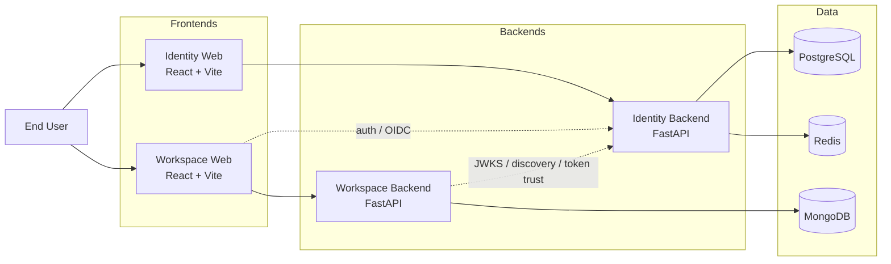
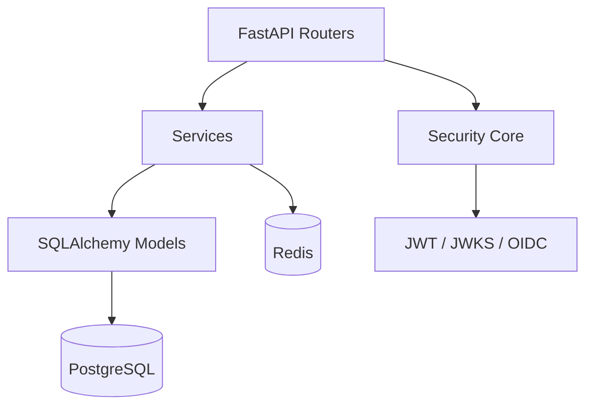
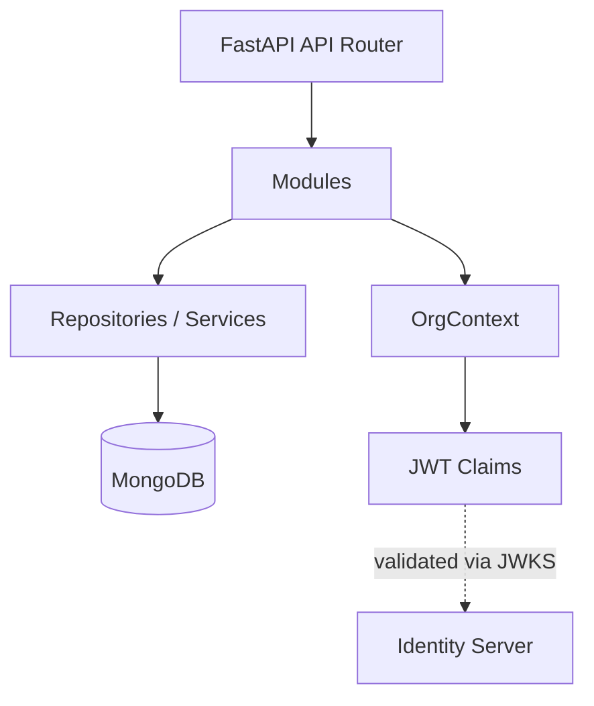
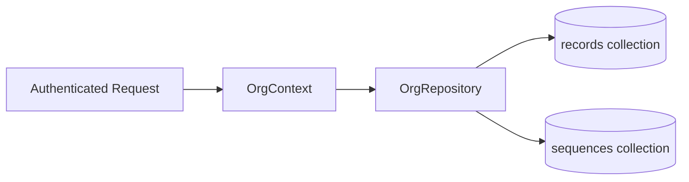
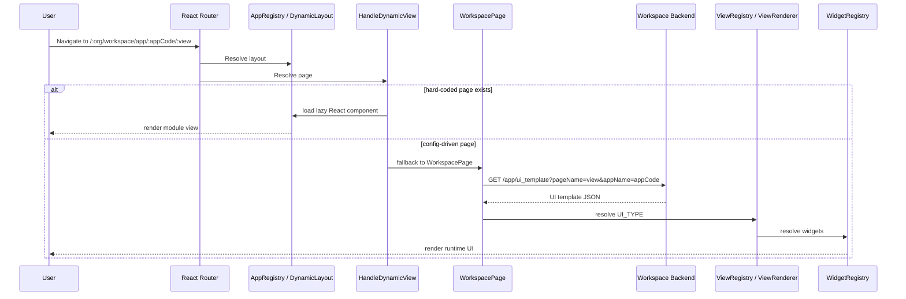
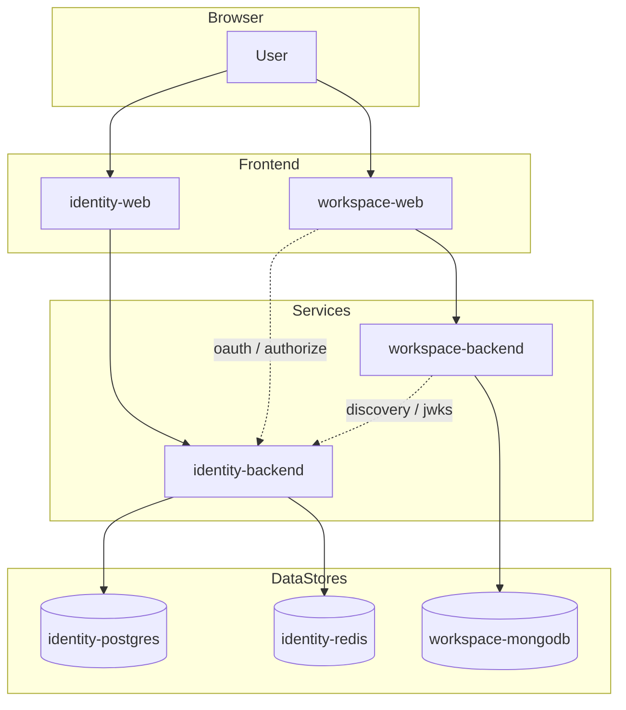
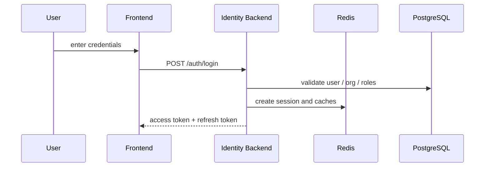
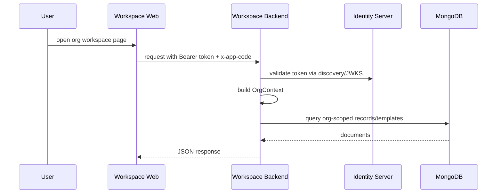
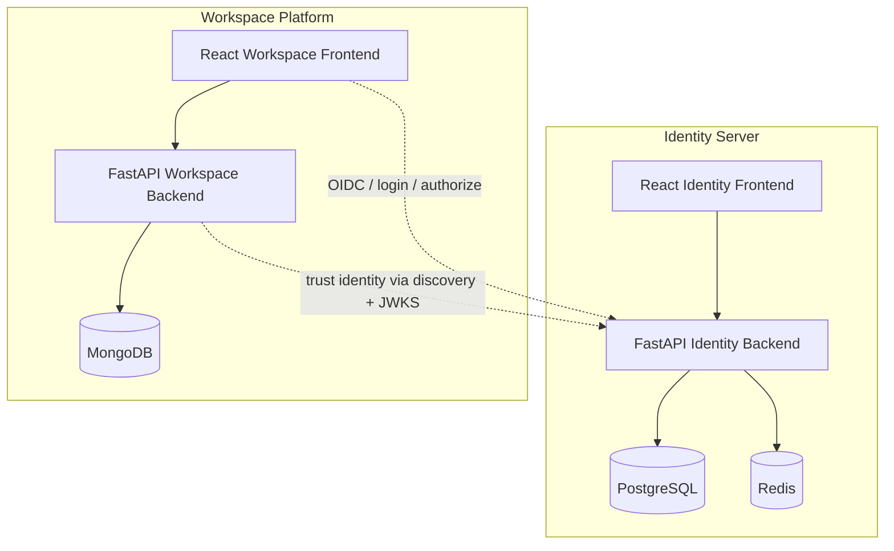

# SaaS Platform Project Architecture

## 1. Architecture Summary

This repository contains a multi-application SaaS platform built around two main products:

1. `identity_server`
   Acts as the control plane for authentication, OAuth2/OIDC, organization onboarding, RBAC/PBAC, SaaS app registration, and subscription-plan management.
2. `work_space`
   Acts as the execution plane for organization-specific applications, dynamic UI delivery, app-specific business modules, and multi-organization data isolation.

The overall architecture follows this pattern:

- Identity owns users, orgs, roles, permissions, policies, apps, plans, and login/session lifecycle.
- Workspace consumes identity-issued tokens and uses the claims to serve org-scoped data and multi-app UI experiences.
- Both frontends use React + Vite + Chakra UI and share the same registry-based plus config-driven rendering approach.
- Workspace supports both:
  - Hard-coded React views registered in `AppRegistry`
  - Config-driven pages fetched from MongoDB and rendered at runtime

---

## 2. Tech Stack

### Platform-Level Stack

| Layer | Technology |
| --- | --- |
| Backend framework | FastAPI |
| Identity database | PostgreSQL |
| Workspace database | MongoDB |
| Cache / sessions | Redis |
| Frontend | React + TypeScript + Vite |
| UI system | Chakra UI v3 |
| State / client utilities | Redux Toolkit, Zustand, RxJS, Axios, Dexie |
| Python package management | `uv` |
| Containers / local infra | Docker Compose |

### Identity Server Stack

| Area | Technology |
| --- | --- |
| Backend | FastAPI |
| ORM / DB layer | SQLAlchemy, SQLModel, Alembic |
| Database | PostgreSQL |
| Session / cache | Redis |
| Security | JWT, JWKS, OAuth2, OpenID Connect |
| Email / notifications | SMTP, Jinja2 templates |
| Payments | Razorpay integration |
| Frontend | React, TypeScript, Vite, Chakra UI |

### Workspace Stack

| Area | Technology |
| --- | --- |
| Backend | FastAPI |
| Database driver | Motor / PyMongo |
| Database | MongoDB |
| Auth validation | JWKS / OpenID discovery from Identity Server |
| File storage | Local storage served by FastAPI static mount |
| Frontend | React, TypeScript, Vite, Chakra UI |
| Dynamic UI engine | App registry + view registry + widget registry + Mongo templates |

---

## 3. System Context



---

## 4. Repository Structure

```text
apps/
|-- identity_server/
|   |-- backend/   # FastAPI auth/control-plane service
|   `-- web/       # React admin/auth frontend
`-- work_space/
    |-- backend/   # FastAPI workspace/data service
    `-- web/       # React multi-org/multi-app frontend

infra/
`-- gitops/
    |-- platform/  # Root platform infra (namespaces, DBs, controllers)
    |-- apps/      # Identity and Workspace apps
    `-- monitoring/ # Observability stack
dev/
|-- docker-compose.dev.yml
|-- docker-compose.data.yml
|-- docker-compose.identity-server.yml
|-- docker-compose.workspace.yml
`-- init-mongo.js

docker-data/
`-- persistent local service data
```

---

## 5. Identity Server Architecture

### 5.1 Responsibilities

The identity service is the security backbone of the platform. Its responsibilities include:

- User authentication and session lifecycle
- OAuth2 / OpenID Connect provider behavior
- JWT issuance and public key exposure through JWKS
- Organization registration and onboarding
- Organization user and role management
- Platform-wide permission and policy management
- SaaS app registration and feature mapping
- Subscription plan and payment handling

### 5.2 Main Backend Structure

```text
apps/identity_server/backend/app/
|-- main.py
|-- config.py
|-- core/
|-- db/
|-- middlewares/
|-- models/
|-- routers/
|-- schemas/
|-- services/
`-- templates/
```

### 5.3 Main Routers

The backend mounts these major route groups from `app/routers`:

- `auth.py`
  Login, refresh, logout, password reset, current-user/session endpoints
- `oauth.py`
  OAuth2 authorization, grant, token, revoke, userinfo
- `client.py`
  OAuth client registration and lifecycle
- `organization_registration.py`
  Org registration, activation, org profile
- `organization_users.py`
  Org user creation and org membership endpoints
- `organization_rbac.py`
  Roles and permissions within organizations
- `policy_management.py`
  PBAC policy CRUD and role-policy attachment
- `platform.py`
  System-level admin operations for org subscriptions, permissions, and policies
- `apps.py`
  SaaS apps and features
- `plans.py`
  Subscription plans
- `payment.py`
  Payment and onboarding status
- `authz.py`
  Authorization evaluation endpoints
- `health.py`, `logs.py`, `webhooks.py`

### 5.4 Identity Backend Layering



### 5.5 Identity Data and Security Design

- PostgreSQL is the system-of-record for structured identity entities such as users, organizations, plans, subscriptions, policies, clients, and feature/app metadata.
- Redis is used for:
  - login sessions
  - user session indexes
  - OAuth consent sessions
  - auth code mapping
  - OTP cache
  - permission cache
  - rate limiting
- JWTs are signed with RSA keys and exposed through `/.well-known/jwks.json`.
- OpenID Connect discovery is exposed through `/.well-known/openid-configuration`.
- Rate limiting is applied to high-risk endpoints such as `/auth/login` and `/oauth2/token`.

### 5.6 Identity Frontend

The identity frontend is a React + TypeScript + Vite application that provides:

- login and signup flows
- forgot-password flow
- OAuth authorize screens
- admin and system-management views
- org/user/role/policy/app/plan UI modules

It uses the same rendering style as workspace:

- lazy-loaded views
- route-driven dynamic layout resolution
- registry-based module mapping
- Chakra UI for interface composition

---

## 6. Workspace Architecture

### 6.1 Responsibilities

The workspace service is the application runtime for multi-organization SaaS usage. Its responsibilities include:

- serving workspace UI template metadata
- serving app configuration and menu configuration
- hosting org-scoped domain data APIs
- validating identity tokens using identity-server discovery and JWKS
- enabling both hard-coded and config-driven application screens
- isolating all business data by organization

### 6.2 Main Backend Structure

```text
apps/work_space/backend/app/
|-- main.py
|-- api/
|-- common/
|-- core/
|-- db/
`-- modules/
    |-- auth/
    |-- gym/
    |-- oauth/
    |-- system/
    `-- users/
```

### 6.3 Workspace Module Inventory

| Module | Purpose |
| --- | --- |
| `system` | UI templates, menu configuration, app configuration |
| `auth` | workspace-side auth endpoints |
| `oauth` | code exchange / callback support |
| `gym` | example business module using org-scoped records |
| `users` | workspace user profile endpoints |

### 6.4 Workspace Backend Layering



### 6.5 OrgContext and Multi-Org Isolation

A key architectural decision in workspace is that organization context is not taken from request payloads. It is derived from:

- JWT claims issued by identity server
- request headers such as `x-app-code`

`OrgContext` carries:

- org identity
- user identity
- selected app code
- subscribed app list

This context is used by `OrgRepository` so queries are automatically filtered by organization.

### 6.6 Unified Record Pattern

Workspace business data uses a generalized MongoDB record pattern:



Each document is composed from three logical sections:

- `_org`
  Immutable tenant and app ownership metadata
- `_meta`
  Audit metadata, version, soft-delete state, generated `record_id`
- `data`
  Business payload

This gives the project:

- strong tenant isolation
- common CRUD behavior
- auditability
- soft-delete support
- reusable patterns across modules

### 6.7 Dynamic Template Storage

Workspace uses MongoDB collections such as:

- `template`
  Stores runtime UI templates
- `app_config`
  Stores menu / app configuration
- `records`
  Stores org-scoped business records
- `uploadFiles`
  Stores uploaded-file metadata

### 6.8 Workspace Backend Auth Integration

Workspace does not own primary identity. Instead, it delegates trust to identity server:

- fetches OpenID discovery metadata
- fetches JWKS
- validates JWT signatures and issuer/audience
- extracts org and user claims from the validated token

This makes workspace a consumer of identity, not a separate identity authority.

---

## 7. Frontend Architecture

Both `apps/identity_server/web` and `apps/work_space/web` are built with nearly the same frontend platform shape:

- React 18
- TypeScript
- Vite
- Chakra UI
- Redux Toolkit
- Zustand
- RxJS
- Axios
- Dexie for client-side cache support

### 7.1 Shared Frontend Rendering Model

The frontend is not only route-driven. It supports two rendering modes:

1. Registry-based rendering
   Hard-coded React screens are lazy-loaded from `AppRegistry`.
2. Config-driven rendering
   If no React screen exists for a route, the app loads a JSON template and renders it through the runtime engine.

### 7.2 Runtime Rendering Pipeline



### 7.3 Frontend Registries

The runtime engine is built around these registries:

- `AppRegistry`
  Maps app and view names to lazy React modules
- `ViewRegistry`
  Maps high-level view types such as `SECTION_VIEW`, `FORM_VIEW`, `GRID_VIEW`, `PAGE_VIEW`
- `WidgetRegistry`
  Maps runtime widget keys such as `textField`, `selectField`, `tabs`, `kpi`, `grid`, `cardGrid`
- `UITypeRegistry`
  Maps section renderer types such as KPI, table, chart, and action sections

### 7.4 Supported Workspace UI Modes

The workspace frontend supports:

- system admin hard-coded views
- app-specific hard-coded modules like `myGym`
- fallback config-driven pages from backend templates
- profile/settings/helpcenter workspace pages
- organization-scoped route patterns such as:
  - `/:organization_name/workspace/app/:appCode/:view`
  - `/:organization_name/workspace/:view`

### 7.5 Local Template Assets

For development, sample JSON templates also exist under:

`apps/work_space/web/DB_CONFIG`

This appears to act as a local reference / seed source for config-driven page design, while the live runtime fetches templates from MongoDB.

---

## 8. Control Plane vs Execution Plane

One useful way to understand the repository is:

### Identity Server = Control Plane

- user identity
- org lifecycle
- access control
- SaaS app catalog
- features
- plans
- subscriptions
- OAuth2 / OIDC provider

### Workspace = Execution Plane

- app runtime
- org-scoped business data
- app menus and templates
- dynamic UI delivery
- tenant-facing workflows

This separation is a strong architectural choice because it keeps identity and policy centralized while letting workspace remain flexible and app-oriented.

---

## 9. Local Development / Deployment Topology

The repo includes a combined Docker Compose setup in `infra/dev/docker-compose.dev.yml` for local container-only development, and a full GitOps setup under `infra/gitops/` for Kubernetes-based deployment.

### Main Services

| Service | Default Port | Role |
| --- | --- | --- |
| `identity-web` | `80` in Docker | Identity frontend |
| `identity-backend` | `8000` | Identity FastAPI backend |
| `identity-postgres` | `5432` | Identity PostgreSQL |
| `identity-redis` | `6379` | Sessions, rate limit, cache |
| `workspace-backend` | `8001` | Workspace FastAPI backend |
| `workspace-web` | `3001` in Docker | Workspace frontend |
| `workspace-mongodb` | `27017` | Workspace MongoDB |
| `workspace-mongo-express` | `8081` | Mongo admin UI |

### Local Runtime Diagram



The repository also includes:

- `start-dev.ps1`
  Starts all four app processes directly from source
- `start-docker-dev.ps1`
  Runs the full Docker Compose environment

---

## 10. End-to-End Request Flows

### 10.1 Login and Token Flow



### 10.2 Workspace Data Flow



### 10.3 Dynamic UI Flow

- User navigates to an app route
- Frontend tries `AppRegistry`
- If a static module exists, render it
- If not, frontend calls workspace backend for `ui_template`
- Workspace backend loads template JSON from MongoDB
- Frontend uses `ViewRegistry` and `WidgetRegistry` to render the UI at runtime

---

## 11. Architectural Strengths

- Clear separation between identity/control-plane concerns and workspace/runtime concerns
- Multi-organization access enforced through token-derived context instead of client-supplied org IDs
- Flexible UI strategy that supports both productized React modules and dynamic config-driven pages
- Good local developer ergonomics through Docker Compose and PowerShell startup scripts
- Redis-backed session, auth-code, OTP, and rate-limit support in the identity layer
- Mongo-based schema flexibility for runtime application modules

---

## 12. Recommended High-Level Architecture Statement

If you need a short project description for documentation or presentations, use this:

> This project is a multi-tenant SaaS platform with a centralized Identity Server and a dynamic Workspace platform. The Identity Server manages authentication, OAuth2/OIDC, users, organizations, roles, policies, SaaS apps, and subscription plans using FastAPI, PostgreSQL, and Redis. The Workspace platform delivers multi-organization, multi-app experiences using FastAPI, MongoDB, and a React-based runtime UI engine that supports both hard-coded components and config-driven pages stored in MongoDB.

---

## 13. Final Architecture View



---

## 14. Path References Used For This Analysis

- `apps/identity_server/backend`
- `apps/identity_server/web`
- `apps/work_space/backend`
- `apps/work_space/web`
- `infra/gitops/platform`
- `infra/gitops/apps`
- `infra/gitops/monitoring`
- `infra/dev/docker-compose.dev.yml`
- `start-dev.ps1`
- `start-docker-dev.ps1`

