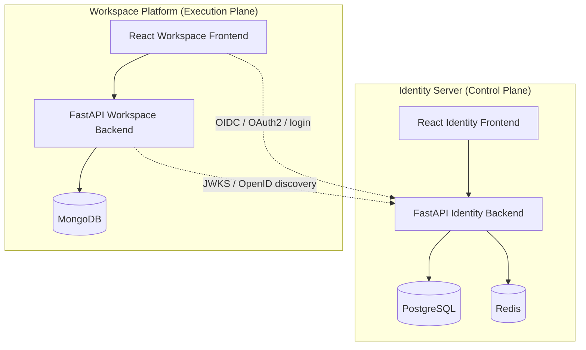

# SaaS Platform

A production-grade, multi-tenant SaaS platform with a centralized **Identity Server** (control plane) and a dynamic **Workspace Platform** (execution plane), fully managed via GitOps on a local Kubernetes cluster.

---

## What This Project Is

This platform enables multiple organizations to log in, access their subscribed applications, and interact with org-scoped data — all through a unified UI driven by both hard-coded React modules and runtime config-driven templates stored in MongoDB.

**Identity Server** is the security backbone:
manages users, organizations, OAuth2/OIDC, roles, permissions, policies, SaaS app catalog, subscription plans, and payments.

**Workspace Platform** is the app runtime:
serves org-scoped data, dynamic frontend templates, and multi-app experiences derived from the identity tokens.

---

## Architecture Overview



---

## Tech Stack

| Layer | Technology |
| :--- | :--- |
| **Identity Backend** | FastAPI, SQLAlchemy, Alembic, PostgreSQL, Redis |
| **Workspace Backend** | FastAPI, Motor/PyMongo, MongoDB |
| **Frontends** | React 18, TypeScript, Vite, Chakra UI v3 |
| **State / Utilities** | Redux Toolkit, Zustand, RxJS, Axios, Dexie |
| **Auth / Security** | OAuth2, OpenID Connect, JWT, JWKS, RSA keys |
| **Payments** | Razorpay integration |
| **Containers** | Docker Compose (local dev) |
| **Orchestration** | Kubernetes (k3d local cluster) |
| **GitOps** | ArgoCD |
| **Secrets** | Bitnami Sealed Secrets |
| **Observability** | Prometheus, Grafana, Loki |
| **Ingress** | NGINX Ingress Controller |
| **Python packaging** | `uv` |

---

## Repository Structure

```text
saas_platform/
├── apps/
│   ├── identity_server/
│   │   ├── backend/          # FastAPI auth/control-plane service
│   │   └── web/              # React admin/auth frontend
│   └── work_space/
│       ├── backend/          # FastAPI workspace/data service
│       └── web/              # React multi-org/multi-app frontend
│
├── infra/
│   ├── dev/                  # Docker Compose files for local dev
│   ├── gitops/               # ArgoCD-managed Kubernetes manifests
│   │   ├── apps/
│   │   │   ├── identity/     # Identity server K8s app manifests
│   │   │   └── workspace/    # Workspace K8s app manifests
│   │   └── infra/            # Cluster infra (sealed-secrets, monitoring, etc.)
│   ├── sealed-secrets-guide.md   # How to create and manage secrets
│   └── note_cmd.md               # Quick command reference
│
├── docker-data/              # Persistent local service volumes
├── .agents/                  # AI agent skills and workflows
├── start-dev.ps1             # Start all services from source (Windows)
├── start-dev.sh              # Start all services from source (Linux/macOS)
├── start-docker-dev.ps1      # Run full Docker Compose environment
└── PROJECT_ARCHITECTURE.md  # Full architecture deep-dive
```

---

## What Is Supported

### Identity Server Features

| Feature | Description |
| :--- | :--- |
| **User Authentication** | Login, logout, signup, password reset, session management |
| **OAuth2 / OIDC Provider** | Authorization code flow, PKCE, token exchange, userinfo, revocation |
| **JWT Issuance** | RSA-signed access and refresh tokens |
| **JWKS Endpoint** | `/.well-known/jwks.json` for public key exposure |
| **OpenID Discovery** | `/.well-known/openid-configuration` |
| **Organization Management** | Register orgs, onboard users, org profile management |
| **RBAC** | Roles and permissions scoped per organization |
| **PBAC** | Policy-based access control with pluggable policy evaluation |
| **OAuth Client Management** | Register and manage OAuth2 clients (first-party and third-party) |
| **SaaS App Catalog** | Register apps, map features to apps |
| **Subscription Plans** | Create and manage plans, assign features and limits |
| **Payments** | Razorpay integration for plan onboarding |
| **Rate Limiting** | Applied to high-risk endpoints (`/auth/login`, `/oauth2/token`) |
| **Redis Sessions** | Session storage, OTP cache, permission cache, auth code mapping |

### Workspace Platform Features

| Feature | Description |
| :--- | :--- |
| **Multi-Organization Isolation** | All data scoped by org via JWT-derived `OrgContext` |
| **Multi-App Support** | Each org can subscribe to multiple apps; routes scoped by `appCode` |
| **Hard-Coded React Modules** | App-specific components lazy-loaded from `AppRegistry` |
| **Config-Driven Pages** | UI templates stored in MongoDB and rendered at runtime |
| **Dynamic UI Engine** | `ViewRegistry`, `WidgetRegistry`, `UITypeRegistry` for runtime rendering |
| **Gym Module** | Example business module with org-scoped member data |
| **User Profile Module** | Workspace user profile and settings |
| **File Storage** | Upload and serve files via FastAPI static mount |
| **Token Validation** | Delegates to Identity Server via JWKS/OpenID discovery |

### Infrastructure & GitOps

| Feature | Description |
| :--- | :--- |
| **ArgoCD** | GitOps continuous delivery — cluster state synced from this repo |
| **Sealed Secrets** | Encrypted secrets safe to commit to Git (see guide below) |
| **Prometheus** | Metrics collection across services |
| **Grafana** | Dashboard visualization for metrics |
| **Loki** | Log aggregation |
| **NGINX Ingress** | Routes traffic to identity and workspace services |
| **k3d** | Lightweight local Kubernetes cluster |
| **ConfigMaps** | Runtime env injection for frontends via NGINX |

---

## GitOps & Secrets

This platform uses **Bitnami Sealed Secrets** to safely store encrypted Kubernetes secrets in Git.

> 📖 Full operational guide: [`infra/sealed-secrets-guide.md`](infra/sealed-secrets-guide.md)

### Quick Reference — Create a New Secret

**PowerShell**
```powershell
# Step 1: Generate (UTF-8 safe)
kubectl create secret generic <secret-name> `
  --from-literal=KEY=value `
  --namespace=<namespace> `
  --dry-run=client -o yaml | Set-Content -Encoding utf8 temp-secret.yaml

# Step 2: Seal
kubeseal --controller-namespace kube-system `
  --controller-name sealed-secrets-controller `
  --format yaml `
  -f temp-secret.yaml `
  -w infra\gitops\apps\<folder>\<secret-name>.yaml

# Step 3: Cleanup
Remove-Item temp-secret.yaml
```

**Linux / macOS**
```bash
kubectl create secret generic <secret-name> \
  --from-literal=KEY=value \
  --namespace=<namespace> \
  --dry-run=client -o yaml \
| kubeseal \
  --controller-namespace kube-system \
  --controller-name sealed-secrets-controller \
  --format yaml \
  > infra/gitops/apps/<folder>/<secret-name>.yaml
```

### Update a Single Key (without re-sealing everything)

**PowerShell**
```powershell
kubectl create secret generic <secret-name> `
  --from-literal=MY_KEY=new-value `
  --namespace=<namespace> `
  --dry-run=client -o yaml | Set-Content -Encoding utf8 temp-secret.yaml

kubeseal --controller-namespace kube-system `
  --controller-name sealed-secrets-controller `
  --format yaml `
  -f temp-secret.yaml `
  --merge-into infra\gitops\apps\<folder>\<secret-name>.yaml

Remove-Item temp-secret.yaml
```

---

## Local Development

### Option A — Docker Compose (recommended for full stack)

**Windows**
```powershell
.\start-docker-dev.ps1
```

**Linux / macOS**
```bash
./start-docker-dev.sh
```

### Option B — Run from Source

**Windows**
```powershell
.\start-dev.ps1
```

**Linux / macOS**
```bash
./start-dev.sh
```

### Services and Ports

| Service | Port | Role |
| :--- | :--- | :--- |
| `identity-backend` | `8000` | Identity FastAPI API |
| `identity-web` | `5173` (dev) | Identity React frontend |
| `identity-postgres` | `5432` | Identity database |
| `identity-redis` | `6379` | Sessions and cache |
| `workspace-backend` | `8001` | Workspace FastAPI API |
| `workspace-web` | `3001` (dev) | Workspace React frontend |
| `workspace-mongodb` | `27017` | Workspace database |
| `workspace-mongo-express` | `8081` | Mongo admin UI |

---

## Documentation

| Document | Purpose |
| :--- | :--- |
| [`PROJECT_ARCHITECTURE.md`](PROJECT_ARCHITECTURE.md) | Full architecture deep-dive with diagrams, module inventory, and request flow sequences |
| [`infra/sealed-secrets-guide.md`](infra/sealed-secrets-guide.md) | How to create, seal, update, and manage Kubernetes secrets across PowerShell, CMD, and Linux |
| [`infra/note_cmd.md`](infra/note_cmd.md) | Quick command cheatsheet for kubectl, ArgoCD, and cluster operations |

---

## Security Notes

- **Never commit `temp-secret.yaml`** — it contains base64-encoded plaintext values. It is in `.gitignore`.
- Sealed Secrets are namespace-scoped — a secret sealed for `workspace` cannot be decrypted in `identity`.
- Private decryption keys never leave the cluster's `kube-system` namespace.
- All JWTs are RSA-signed and validated via JWKS — workspace trusts identity, not raw tokens.
