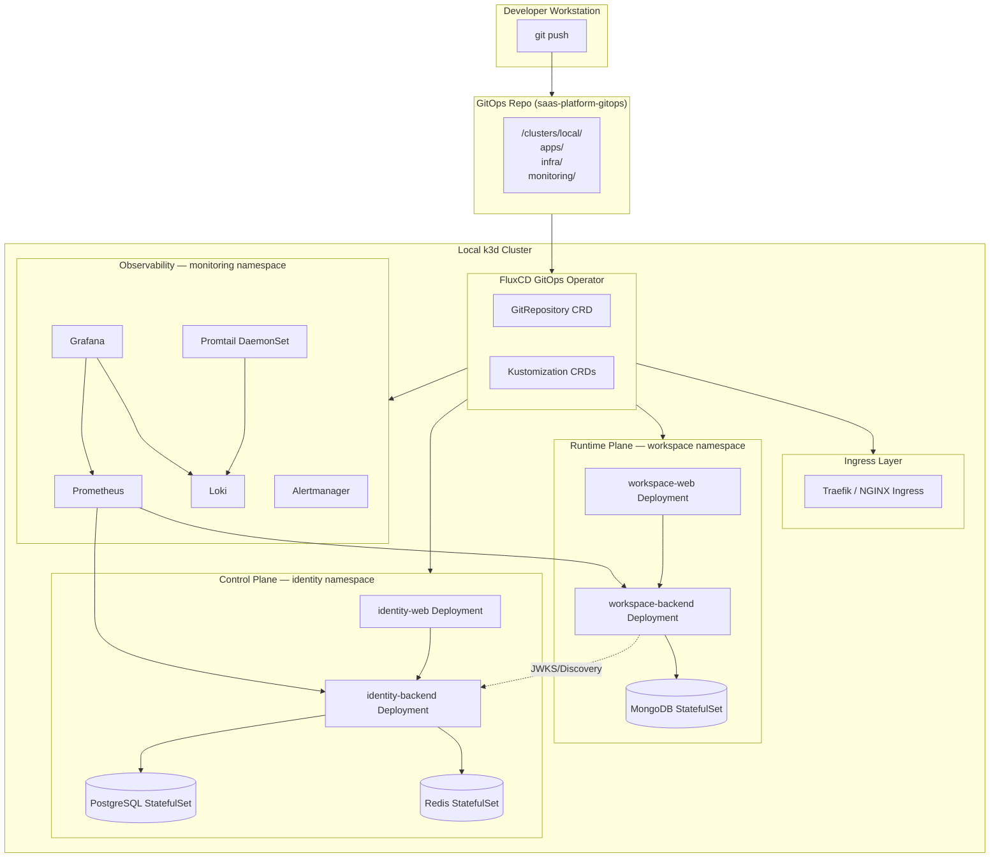
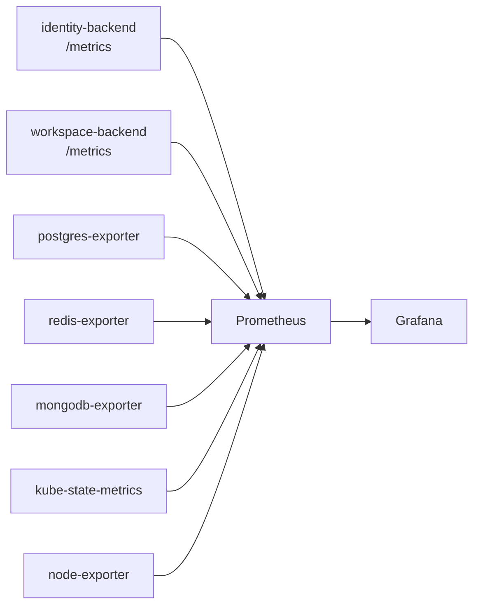
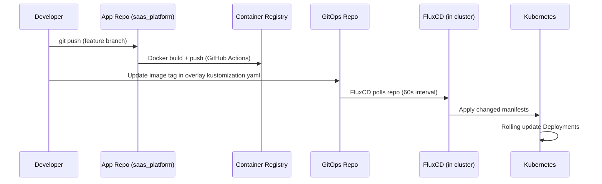

# GitOps + Kubernetes + Grafana: Production Architecture Plan

## Goal

Deploy the full SaaS multi-tenant platform — **Identity Server** (FastAPI + PostgreSQL + Redis) and **Workspace** (FastAPI + MongoDB + React) — onto a **local Kubernetes cluster** using a production-grade **GitOps** pipeline with **Grafana observability**, modelled exactly like a real cloud production deployment.

---

## Architecture Overview



---

## 1. Tool Selection

| Concern | Tool | Reason |
|---|---|---|
| **Local Cluster** | `k3d` (k3s in Docker) | Lightweight, production-compatible, runs on Windows Docker Desktop |
| **GitOps Operator** | **FluxCD v2** | Native Kubernetes CRDs, pull-based, excellent Kustomize + Helm support |
| **Container Registry** | `k3d` local registry OR GitHub Container Registry (GHCR) | No external cost for local dev |
| **Ingress** | Traefik (built into k3s) | Already present in k3d; no extra install |
| **Secrets** | Kubernetes Secrets + **Sealed Secrets** | Encrypted secrets safe to commit to Git |
| **Metrics** | **Prometheus** (kube-prometheus-stack Helm chart) | Industry standard |
| **Dashboards** | **Grafana** | Paired with Prometheus + Loki |
| **Logs** | **Loki + Promtail** | Lightweight log aggregation |
| **Alerting** | **Alertmanager** (part of kube-prometheus-stack) | Integrated alert routing |
| **Package Manager** | Helm + Kustomize | Official FluxCD support |

---

## 2. GitOps Repository Design

> [!IMPORTANT]
> The GitOps repo is **separate** from the application source code repo. It contains **only Kubernetes manifests, Helm values, and Kustomize overlays** — NOT the application code.

### Recommended: Two-Repo Strategy

```text
saas_platform/          ← APPLICATION SOURCE (existing repo)
  apps/
  infra/
  ...

saas-platform-gitops/   ← GITOPS REPO (NEW repo to create)
  clusters/
  apps/
  infra/
  monitoring/
```

### GitOps Repo Full Tree

```text
saas-platform-gitops/
│
├── clusters/
│   └── local/                        # Target cluster: local k3d
│       ├── flux-system/              # FluxCD bootstrap manifests (auto-generated)
│       │   ├── gotk-components.yaml
│       │   ├── gotk-sync.yaml
│       │   └── kustomization.yaml
│       │
│       ├── apps.yaml                 # FluxCD Kustomization → /apps
│       ├── infra.yaml                # FluxCD Kustomization → /infra
│       └── monitoring.yaml           # FluxCD Kustomization → /monitoring
│
├── apps/
│   ├── base/
│   │   ├── identity-backend/
│   │   │   ├── deployment.yaml
│   │   │   ├── service.yaml
│   │   │   ├── configmap.yaml
│   │   │   ├── hpa.yaml
│   │   │   └── kustomization.yaml
│   │   ├── identity-web/
│   │   │   ├── deployment.yaml
│   │   │   ├── service.yaml
│   │   │   └── kustomization.yaml
│   │   ├── workspace-backend/
│   │   │   ├── deployment.yaml
│   │   │   ├── service.yaml
│   │   │   ├── configmap.yaml
│   │   │   ├── hpa.yaml
│   │   │   └── kustomization.yaml
│   │   └── workspace-web/
│   │       ├── deployment.yaml
│   │       ├── service.yaml
│   │       └── kustomization.yaml
│   │
│   └── overlays/
│       └── local/
│           ├── identity-backend/
│           │   ├── kustomization.yaml   # patches image tag, env overrides
│           │   └── patch-replicas.yaml
│           ├── workspace-backend/
│           │   ├── kustomization.yaml
│           │   └── patch-replicas.yaml
│           └── kustomization.yaml       # aggregates all app overlays
│
├── infra/
│   ├── namespaces/
│   │   ├── identity.yaml
│   │   ├── workspace.yaml
│   │   └── monitoring.yaml
│   │
│   ├── identity-postgres/
│   │   ├── statefulset.yaml
│   │   ├── service.yaml
│   │   ├── pvc.yaml
│   │   └── secret.yaml              # SealedSecret in Git
│   │
│   ├── identity-redis/
│   │   ├── statefulset.yaml
│   │   ├── service.yaml
│   │   └── pvc.yaml
│   │
│   ├── workspace-mongodb/
│   │   ├── statefulset.yaml
│   │   ├── service.yaml
│   │   ├── pvc.yaml
│   │   └── secret.yaml              # SealedSecret in Git
│   │
│   ├── ingress/
│   │   ├── identity.yaml            # Ingress rules for identity services
│   │   └── workspace.yaml           # Ingress rules for workspace services
│   │
│   └── sealed-secrets/
│       └── helmrelease.yaml         # Sealed Secrets controller via Helm
│
└── monitoring/
    ├── namespace.yaml
    ├── kube-prometheus-stack/
    │   ├── helmrepository.yaml      # Prometheus community Helm repo
    │   ├── helmrelease.yaml         # kube-prometheus-stack chart values
    │   └── values.yaml              # Grafana + Prometheus + AlertManager config
    │
    ├── loki-stack/
    │   ├── helmrepository.yaml
    │   └── helmrelease.yaml
    │
    ├── grafana-dashboards/
    │   ├── identity-backend.json    # Custom dashboard for identity service
    │   ├── workspace-backend.json   # Custom dashboard for workspace service
    │   └── platform-overview.json  # Cross-service platform health dashboard
    │
    └── alerting/
        ├── prometheus-rules.yaml    # Custom PrometheusRule CRDs
        └── alertmanager-config.yaml # Alert routing (email/webhook/slack)
```

---

## 3. Namespace Design

```text
identity     → identity-backend, identity-web, postgres, redis
workspace    → workspace-backend, workspace-web, mongodb
monitoring   → prometheus, grafana, loki, promtail, alertmanager
flux-system  → FluxCD controllers (auto-created)
kube-system  → Traefik ingress (auto-present in k3s)
```

---

## 4. Network / Ingress Design

All services exposed via **single Traefik ingress** on `localhost` with path-based routing:

| Host/Path | Target Service |
|---|---|
| `identity.local/` | identity-web |
| `identity.local/api/` | identity-backend |
| `workspace.local/` | workspace-web |
| `workspace.local/api/` | workspace-backend |
| `grafana.local/` | Grafana |
| `prometheus.local/` | Prometheus |
| `alertmanager.local/` | Alertmanager |

> Edit `C:\Windows\System32\drivers\etc\hosts` to point all `*.local` to `127.0.0.1`

---

## 5. Observability Stack (Grafana + Prometheus + Loki)

### 5.1 Metrics Collection



Both FastAPI backends need to expose a `/metrics` endpoint via `prometheus-fastapi-instrumentator`.

### 5.2 Log Aggregation


### 5.3 Grafana Dashboards (3 Planned)

| Dashboard | Contents |
|---|---|
| **Platform Overview** | Request rates, error rates, latency p50/p99 across all services |
| **Identity Server** | Login attempts, OAuth token issuance, Redis cache hit rate, DB connection pool |
| **Workspace** | API throughput, org-scoped query performance, MongoDB ops/sec |

### 5.4 Alerting Rules

| Alert | Condition |
|---|---|
| `HighErrorRate` | HTTP 5xx rate > 1% for 5m |
| `HighLatency` | p99 > 2s for 5m |
| `PodCrashLooping` | Pod restart count > 3 in 10m |
| `DatabaseDown` | Postgres/MongoDB/Redis unreachable > 1m |
| `LowDiskSpace` | PVC usage > 80% |

---

## 6. Kubernetes Resource Design Per Service

### identity-backend

```yaml
replicas: 2
resources:
  requests: cpu: 250m, memory: 256Mi
  limits:   cpu: 500m, memory: 512Mi
HPA: minReplicas: 2, maxReplicas: 5, CPU target: 70%
probes:
  liveness:  GET /health
  readiness: GET /health/ready
```

### workspace-backend

```yaml
replicas: 2
resources:
  requests: cpu: 250m, memory: 256Mi
  limits:   cpu: 500m, memory: 512Mi
HPA: minReplicas: 2, maxReplicas: 5, CPU target: 70%
probes:
  liveness:  GET /health
  readiness: GET /health/ready
```

### identity-web / workspace-web (static Nginx)

```yaml
replicas: 1
resources:
  requests: cpu: 50m, memory: 64Mi
  limits:   cpu: 100m, memory: 128Mi
```

### PostgreSQL

```yaml
kind: StatefulSet
replicas: 1
storage: 5Gi PVC (local-path StorageClass in k3s)
```

### Redis

```yaml
kind: StatefulSet
replicas: 1
storage: 1Gi PVC
```

### MongoDB

```yaml
kind: StatefulSet
replicas: 1
storage: 5Gi PVC
```

---

## 7. Secrets Strategy

> [!WARNING]
> Never commit raw Kubernetes Secrets to Git. Use **Sealed Secrets** so encrypted values are safe to version-control.

### Secrets per service

| Secret | Namespace | Contains |
|---|---|---|
| `identity-db-secret` | identity | POSTGRES_USER, POSTGRES_PASSWORD, DATABASE_URL |
| `identity-redis-secret` | identity | REDIS_URL |
| `identity-app-secret` | identity | SECRET_KEY, JWT_PRIVATE_KEY |
| `workspace-db-secret` | workspace | MONGO_URI, MONGO_INITDB_ROOT_PASSWORD |
| `workspace-app-secret` | workspace | all workspace .env vars |
| `grafana-admin-secret` | monitoring | GRAFANA_ADMIN_PASSWORD |

---

## 8. CI/CD + GitOps Flow



### GitHub Actions Workflow (App Repo)

Two workflows:
1. **`build-identity.yml`** — builds `apps/identity_server/backend` + `apps/identity_server/web`
2. **`build-workspace.yml`** — builds `apps/work_space/backend` + `apps/work_space/web`

Each pushes images tagged with Git SHA to GHCR.

---

## 9. Local Setup — Step-by-Step Phases

### Phase 1 — Local Cluster Bootstrap

```text
1. Install: Docker Desktop, k3d, kubectl, flux CLI, helm, kubeseal
2. Create k3d cluster with local registry
3. Verify cluster: kubectl cluster-info
```

### Phase 2 — GitOps Repo Bootstrap

```text
1. Create new GitHub repo: saas-platform-gitops
2. Run: flux bootstrap github --owner=<org> --repo=saas-platform-gitops --path=clusters/local
3. FluxCD installs itself into flux-system namespace
4. Verify: flux get all
```

### Phase 3 — Infrastructure Layer

```text
1. Commit infra/ manifests (namespaces, PVCs, StatefulSets, Sealed Secrets)
2. Flux reconciles → Postgres, Redis, MongoDB come up
3. Verify: kubectl get pods -n identity && kubectl get pods -n workspace
```

### Phase 4 — Application Layer

```text
1. Build + push Docker images for all 4 services
2. Commit apps/ manifests with correct image tags
3. Flux reconciles → all 4 Deployments roll out
4. Verify: kubectl get pods -A
```

### Phase 5 — Ingress + Hosts

```text
1. Get k3d LoadBalancer IP
2. Add *.local entries to Windows hosts file
3. Verify all UIs accessible in browser
```

### Phase 6 — Observability Stack

```text
1. Commit monitoring/ HelmRelease for kube-prometheus-stack
2. Commit monitoring/ HelmRelease for loki-stack
3. Flux reconciles → Grafana, Prometheus, Loki come up
4. Import custom dashboards via ConfigMap provisioning
5. Verify: open grafana.local
```

---

## 10. Proposed File Creation Timeline

| Priority | What to Create |
|---|---|
| **P0** | `saas-platform-gitops` repository on GitHub |
| **P0** | `infra/namespaces/` — 3 namespace YAMLs |
| **P0** | `infra/identity-postgres/` — StatefulSet + PVC + SealedSecret |
| **P0** | `infra/identity-redis/` — StatefulSet |
| **P0** | `infra/workspace-mongodb/` — StatefulSet + PVC + SealedSecret |
| **P1** | `apps/base/` — all 4 service Deployments + Services |
| **P1** | `apps/overlays/local/` — env patches + image tags |
| **P1** | `infra/ingress/` — Traefik IngressRoute |
| **P2** | `monitoring/kube-prometheus-stack/` HelmRelease |
| **P2** | `monitoring/loki-stack/` HelmRelease |
| **P2** | `monitoring/grafana-dashboards/` JSON ConfigMaps |
| **P2** | `monitoring/alerting/` PrometheusRule + AlertManager config |
| **P3** | `.github/workflows/` — Docker build + push GitHub Actions |
| **P3** | Sealed Secrets for all app environment variables |

---

## 11. Open Questions for User Review

> [!IMPORTANT]
> **Q1: Application `.env` files** — Do your FastAPI backends currently read from `.env` files or from OS environment variables? This determines how we inject Kubernetes Secrets into pods.

> [!IMPORTANT]
> **Q2: Do your FastAPI backends expose `/metrics` or `/health` endpoints?** If not, we need to add `prometheus-fastapi-instrumentator` to both backends before deploying.

> [!IMPORTANT]
> **Q3: Image registry preference** — Do you want to use **GitHub Container Registry (GHCR)** (requires GitHub account + PAT) or a **local k3d registry** (simpler but images don't persist across cluster recreations)?

> [!NOTE]
> **Q4: GitOps operator preference** — The plan above uses **FluxCD v2**. Do you prefer **ArgoCD** instead? ArgoCD has a richer web UI but is heavier. FluxCD is lighter and more CLI-driven.

> [!NOTE]
> **Q5: Alerting channel** — Where should Alertmanager send alerts? Options: Slack webhook, email (SMTP), or MS Teams webhook?

---

## 12. Verification Plan

| Check | Command |
|---|---|
| Cluster healthy | `kubectl get nodes` |
| All pods running | `kubectl get pods -A` |
| FluxCD synced | `flux get all` |
| Identity API | `curl http://identity.local/api/health` |
| Workspace API | `curl http://workspace.local/api/health` |
| Grafana running | open `http://grafana.local` |
| Prometheus scraping | open `http://prometheus.local/targets` |
| Logs in Loki | Grafana → Explore → Loki |
| Alert rules loaded | `http://prometheus.local/rules` |
