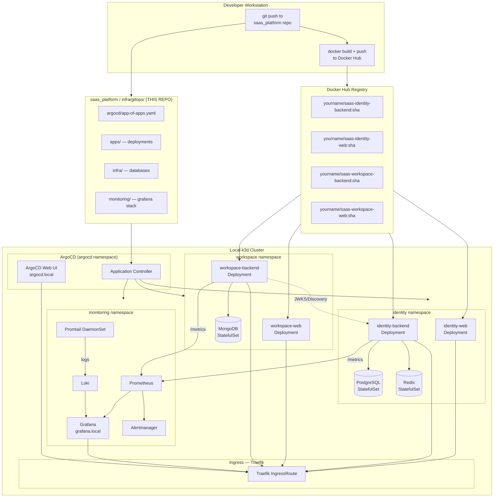
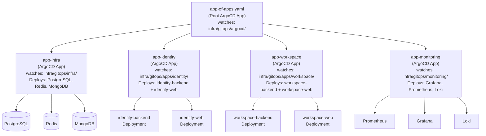
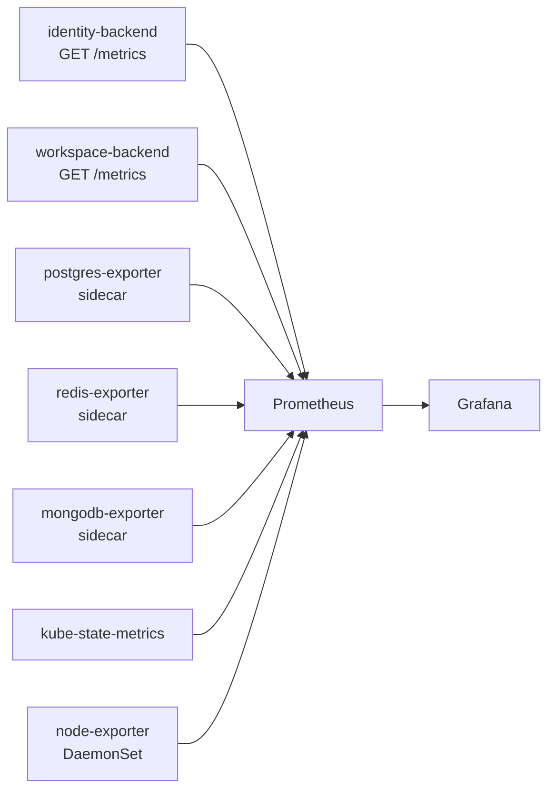
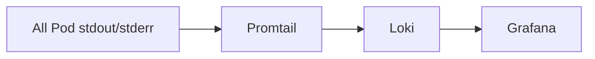
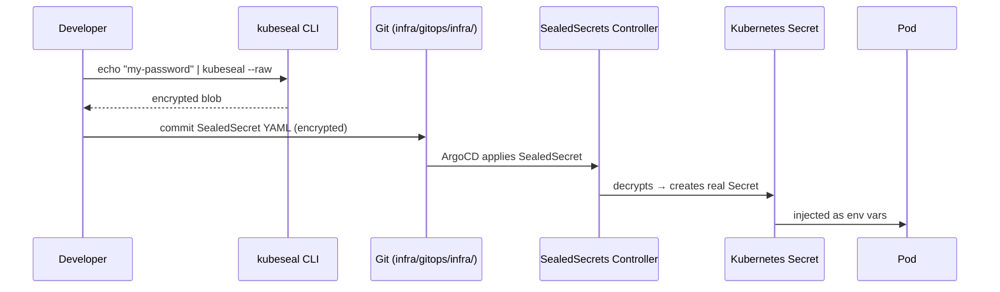
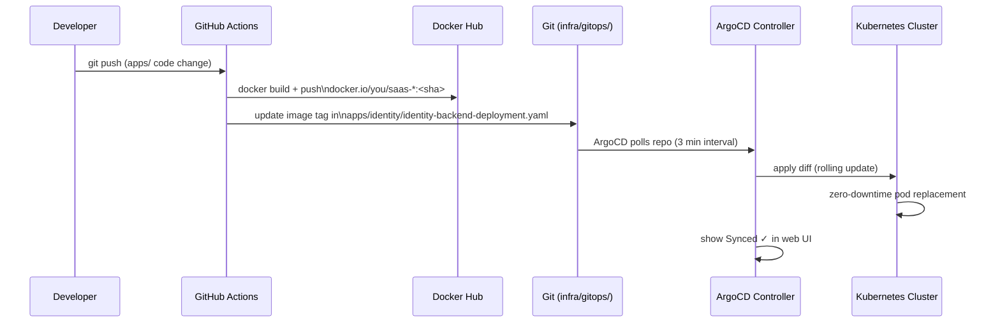

# GitOps + Kubernetes + ArgoCD + Grafana: Production Architecture Plan

## Key Decisions Made

| Decision | Choice | Reason |
|---|---|---|
| **GitOps location** | `infra/gitops/` inside existing monorepo | No second repo needed; single source of truth |
| **GitOps operator** | **ArgoCD** | Rich web UI, visual sync status, rollback UI |
| **Container registry** | **Docker Hub** | `docker.io/<username>/saas-*` image naming |
| **Local cluster** | **k3d** (k3s in Docker) | Lightweight, production-identical, runs on Windows |
| **Ingress** | **Traefik** (built into k3s) | Zero extra install |
| **Secrets** | **Sealed Secrets** | Encrypted secrets safe to commit in Git |
| **Metrics** | **Prometheus** | kube-prometheus-stack Helm chart |
| **Dashboards + Logs** | **Grafana + Loki** | Full observability stack |
| **Alerting** | **Alertmanager** | Integrated with Prometheus |

---

## 1. Full Architecture Diagram



---

## 2. Monorepo Directory Layout

> [!IMPORTANT]
> All GitOps manifests live **inside the existing `saas_platform` repo** under `infra/gitops/`. ArgoCD watches this path and auto-syncs Kubernetes state.

```text
saas_platform/
├── apps/
│   ├── identity_server/
│   └── work_space/
│
├── infra/
│   ├── dev/                          ← EXISTING Docker Compose files
│   │
│   └── gitops/                       ← NEW: ALL KUBERNETES / ARGOCD MANIFESTS
│       │
│       ├── argocd/                   ← ArgoCD bootstrap & App definitions
│       │   ├── install.yaml          # ArgoCD install manifest (pinned version)
│       │   ├── app-of-apps.yaml      # Root ArgoCD Application (App-of-Apps)
│       │   ├── app-identity.yaml     # ArgoCD App → apps/identity/
│       │   ├── app-workspace.yaml    # ArgoCD App → apps/workspace/
│       │   ├── app-infra.yaml        # ArgoCD App → infra/
│       │   └── app-monitoring.yaml   # ArgoCD App → monitoring/
│       │
│       ├── apps/
│       │   ├── identity/
│       │   │   ├── kustomization.yaml
│       │   │   ├── namespace.yaml
│       │   │   ├── identity-backend-deployment.yaml
│       │   │   ├── identity-backend-service.yaml
│       │   │   ├── identity-backend-configmap.yaml
│       │   │   ├── identity-backend-hpa.yaml
│       │   │   ├── identity-web-deployment.yaml
│       │   │   ├── identity-web-service.yaml
│       │   │   └── ingress.yaml
│       │   │
│       │   └── workspace/
│       │       ├── kustomization.yaml
│       │       ├── namespace.yaml
│       │       ├── workspace-backend-deployment.yaml
│       │       ├── workspace-backend-service.yaml
│       │       ├── workspace-backend-configmap.yaml
│       │       ├── workspace-backend-hpa.yaml
│       │       ├── workspace-web-deployment.yaml
│       │       ├── workspace-web-service.yaml
│       │       └── ingress.yaml
│       │
│       ├── infra/
│       │   ├── kustomization.yaml
│       │   ├── sealed-secrets-controller.yaml  # Helm install via manifest
│       │   ├── identity-postgres/
│       │   │   ├── statefulset.yaml
│       │   │   ├── service.yaml
│       │   │   ├── pvc.yaml
│       │   │   └── sealed-secret.yaml          # Encrypted PG credentials
│       │   ├── identity-redis/
│       │   │   ├── statefulset.yaml
│       │   │   ├── service.yaml
│       │   │   └── pvc.yaml
│       │   └── workspace-mongodb/
│       │       ├── statefulset.yaml
│       │       ├── service.yaml
│       │       ├── pvc.yaml
│       │       └── sealed-secret.yaml          # Encrypted Mongo credentials
│       │
│       └── monitoring/
│           ├── kustomization.yaml
│           ├── namespace.yaml
│           ├── kube-prometheus-stack/
│           │   ├── helmchart.yaml              # ArgoCD manages Helm chart
│           │   └── values.yaml                 # Grafana + Prometheus config
│           ├── loki-stack/
│           │   ├── helmchart.yaml
│           │   └── values.yaml
│           ├── dashboards/
│           │   ├── platform-overview.json      # Cross-service health
│           │   ├── identity-backend.json       # Identity API metrics
│           │   └── workspace-backend.json      # Workspace API metrics
│           └── alerting/
│               ├── prometheus-rules.yaml       # Custom alert rules
│               └── alertmanager-config.yaml    # Alert routing
│
├── .github/
│   └── workflows/
│       ├── build-identity.yml        # Build + push identity images
│       └── build-workspace.yml       # Build + push workspace images
│
└── PROJECT_ARCHITECTURE.md
```

---

## 3. ArgoCD App-of-Apps Pattern

This is the **core GitOps pattern**. One root ArgoCD Application manages all other Applications.



**Sync Order (dependency aware):**
```
infra (databases) → apps (backends + frontends) → monitoring
```
ArgoCD Applications use `syncWave` annotations to enforce ordering:
- `infra` = wave 0
- `apps` = wave 1
- `monitoring` = wave 2

---

## 4. Docker Hub Image Naming Convention

```text
docker.io/<your-dockerhub-username>/saas-identity-backend:latest
docker.io/<your-dockerhub-username>/saas-identity-backend:<git-sha>

docker.io/<your-dockerhub-username>/saas-identity-web:latest
docker.io/<your-dockerhub-username>/saas-identity-web:<git-sha>

docker.io/<your-dockerhub-username>/saas-workspace-backend:latest
docker.io/<your-dockerhub-username>/saas-workspace-backend:<git-sha>

docker.io/<your-dockerhub-username>/saas-workspace-web:latest
docker.io/<your-dockerhub-username>/saas-workspace-web:<git-sha>
```

**Local push flow (before CI/CD is set up):**
```powershell
# Example for identity-backend
docker build -t yourname/saas-identity-backend:latest ./apps/identity_server/backend
docker push yourname/saas-identity-backend:latest
# Then update image tag in infra/gitops/apps/identity/identity-backend-deployment.yaml
# git commit + push → ArgoCD auto-syncs
```

---

## 5. Ingress URL Map (Windows hosts file)

Add these to `C:\Windows\System32\drivers\etc\hosts`:
```
127.0.0.1   identity.local
127.0.0.1   workspace.local
127.0.0.1   argocd.local
127.0.0.1   grafana.local
127.0.0.1   prometheus.local
127.0.0.1   alertmanager.local
```

| URL | Service |
|---|---|
| `http://identity.local` | Identity Web (React) |
| `http://identity.local/api/` | Identity Backend (FastAPI) |
| `http://workspace.local` | Workspace Web (React) |
| `http://workspace.local/api/` | Workspace Backend (FastAPI) |
| `http://argocd.local` | **ArgoCD Web UI** |
| `http://grafana.local` | **Grafana Dashboards** |
| `http://prometheus.local` | Prometheus |
| `http://alertmanager.local` | Alertmanager |

---

## 6. Observability Stack Design

### 6.1 Metrics Pipeline



> [!IMPORTANT]
> Both FastAPI backends need `prometheus-fastapi-instrumentator` added to expose `/metrics`. This will be done **before** building Docker images.

### 6.2 Log Pipeline



### 6.3 Three Custom Grafana Dashboards

| Dashboard | Panels Included |
|---|---|
| **Platform Overview** | Total RPS, global error rate, pod health, PVC usage |
| **Identity Server** | Login RPS, OAuth token issuance rate, Redis hit rate, JWT errors, DB pool size |
| **Workspace** | Workspace API RPS, org query latency, MongoDB ops/sec, 4xx/5xx breakdown |

### 6.4 Alerting Rules

| Alert Name | Condition | Severity |
|---|---|---|
| `HighErrorRate` | HTTP 5xx > 1% for 5m | critical |
| `HighLatencyP99` | p99 latency > 2s for 5m | warning |
| `PodCrashLooping` | restart count > 3 in 10m | critical |
| `DatabaseUnreachable` | scrape fail for Postgres/Mongo/Redis > 1m | critical |
| `PVCHighUsage` | PVC used > 80% | warning |
| `HighMemoryUsage` | Pod memory > 90% of limit for 10m | warning |

---

## 7. Kubernetes Resource Specs Per Service

### identity-backend

```yaml
image: docker.io/<you>/saas-identity-backend:<sha>
replicas: 2
resources:
  requests: { cpu: 250m, memory: 256Mi }
  limits:   { cpu: 500m, memory: 512Mi }
HPA:
  minReplicas: 2
  maxReplicas: 5
  targetCPUUtilizationPercentage: 70
probes:
  livenessProbe:  GET /health (initial delay 15s)
  readinessProbe: GET /health/ready (initial delay 10s)
```

### workspace-backend

```yaml
image: docker.io/<you>/saas-workspace-backend:<sha>
replicas: 2
resources:
  requests: { cpu: 250m, memory: 256Mi }
  limits:   { cpu: 500m, memory: 512Mi }
HPA: minReplicas: 2 → maxReplicas: 5 @ 70% CPU
probes:
  livenessProbe:  GET /health
  readinessProbe: GET /health/ready
```

### identity-web / workspace-web (Nginx static)

```yaml
image: docker.io/<you>/saas-identity-web:<sha>
replicas: 1
resources:
  requests: { cpu: 50m, memory: 64Mi }
  limits:   { cpu: 100m, memory: 128Mi }
```

### PostgreSQL StatefulSet

```yaml
image: postgres:15
storage: 5Gi (local-path StorageClass — default in k3s)
secret: identity-postgres-secret (SealedSecret in Git)
```

### Redis StatefulSet

```yaml
image: redis:7-alpine
storage: 1Gi
```

### MongoDB StatefulSet

```yaml
image: mongo:7
storage: 5Gi
secret: workspace-mongodb-secret (SealedSecret in Git)
initScript: /docker-entrypoint-initdb.d/init-mongo.js (ConfigMap mount)
```

---

## 8. Secrets Strategy — Sealed Secrets

> [!WARNING]
> Raw Kubernetes `Secret` manifests must **never be committed to Git**. We use **Sealed Secrets** — encrypted by a controller key in the cluster. Only the cluster can decrypt them.

### Workflow



### Secrets Matrix

| SealedSecret Name | Namespace | Contains |
|---|---|---|
| `identity-postgres-secret` | identity | `POSTGRES_USER`, `POSTGRES_PASSWORD`, `DATABASE_URL` |
| `identity-redis-secret` | identity | `REDIS_URL` |
| `identity-app-secret` | identity | `SECRET_KEY`, `JWT_PRIVATE_KEY`, `SMTP_*` |
| `workspace-mongodb-secret` | workspace | `MONGO_URI`, `MONGO_INITDB_ROOT_PASSWORD` |
| `workspace-app-secret` | workspace | all workspace `.env` vars |
| `dockerhub-secret` | all namespaces | `dockerconfigjson` for pulling private images |
| `grafana-admin-secret` | monitoring | `GF_SECURITY_ADMIN_PASSWORD` |

---

## 9. CI/CD + GitOps Flow



### GitHub Actions Workflows

**`.github/workflows/build-identity.yml`**
- Triggers on push to `apps/identity_server/**`
- Builds: `saas-identity-backend` + `saas-identity-web`
- Pushes to Docker Hub with `${{ github.sha }}` tag
- Updates image tag in `infra/gitops/apps/identity/`

**`.github/workflows/build-workspace.yml`**
- Triggers on push to `apps/work_space/**`
- Builds: `saas-workspace-backend` + `saas-workspace-web`
- Pushes to Docker Hub with `${{ github.sha }}` tag
- Updates image tag in `infra/gitops/apps/workspace/`

---

## 10. Local Machine Setup — Phased Plan

### Prerequisites to Install

```powershell
# 1. Docker Desktop (already likely installed)
# 2. k3d
winget install k3d

# 3. kubectl
winget install Kubernetes.kubectl

# 4. ArgoCD CLI
winget install argoproj.argocd

# 5. Helm
winget install Helm.Helm

# 6. kubeseal (for Sealed Secrets)
# Download from: https://github.com/bitnami-labs/sealed-secrets/releases
```

### Phase 1 — Create Local Cluster

```powershell
# Create k3d cluster with 1 server + 2 agents + port mapping
k3d cluster create saas-local `
  --port "80:80@loadbalancer" `
  --port "443:443@loadbalancer" `
  --agents 2

# Verify
kubectl cluster-info
kubectl get nodes
```

### Phase 2 — Install ArgoCD

```powershell
# Install ArgoCD into cluster
kubectl create namespace argocd
kubectl apply -n argocd -f https://raw.githubusercontent.com/argoproj/argo-cd/stable/manifests/install.yaml

# Wait for pods
kubectl wait --for=condition=ready pod -l app.kubernetes.io/name=argocd-server -n argocd --timeout=120s

# Expose via port-forward (before Ingress is ready)
kubectl port-forward svc/argocd-server -n argocd 8080:443

# Get initial admin password
argocd admin initial-password -n argocd

# Login
argocd login localhost:8080
```

### Phase 3 — Bootstrap App-of-Apps

```powershell
# Point ArgoCD at the gitops root in THIS repo
argocd app create app-of-apps `
  --repo https://github.com/<you>/saas_platform `
  --path infra/gitops/argocd `
  --dest-server https://kubernetes.default.svc `
  --dest-namespace argocd `
  --sync-policy automated

# ArgoCD reads app-of-apps.yaml → creates all child Applications
# Sync order: infra → apps → monitoring (via syncWave)
```

### Phase 4 — Build & Push Docker Images

```powershell
# Identity Backend
docker build -t yourname/saas-identity-backend:latest ./apps/identity_server/backend
docker push yourname/saas-identity-backend:latest

# Identity Web
docker build -t yourname/saas-identity-web:latest ./apps/identity_server/web
docker push yourname/saas-identity-web:latest

# Workspace Backend
docker build -t yourname/saas-workspace-backend:latest ./apps/work_space/backend
docker push yourname/saas-workspace-backend:latest

# Workspace Web
docker build -t yourname/saas-workspace-web:latest ./apps/work_space/web
docker push yourname/saas-workspace-web:latest
```

### Phase 5 — Hosts File + Ingress Verification

```powershell
# Add to C:\Windows\System32\drivers\etc\hosts (run as Admin)
Add-Content "C:\Windows\System32\drivers\etc\hosts" "127.0.0.1 identity.local"
Add-Content "C:\Windows\System32\drivers\etc\hosts" "127.0.0.1 workspace.local"
Add-Content "C:\Windows\System32\drivers\etc\hosts" "127.0.0.1 argocd.local"
Add-Content "C:\Windows\System32\drivers\etc\hosts" "127.0.0.1 grafana.local"
Add-Content "C:\Windows\System32\drivers\etc\hosts" "127.0.0.1 prometheus.local"
Add-Content "C:\Windows\System32\drivers\etc\hosts" "127.0.0.1 alertmanager.local"
```

### Phase 6 — Verify Everything

| Check | Command |
|---|---|
| All pods running | `kubectl get pods -A` |
| ArgoCD apps healthy | `argocd app list` |
| Identity API | `curl http://identity.local/api/health` |
| Workspace API | `curl http://workspace.local/api/health` |
| ArgoCD UI | Browser → `http://argocd.local` |
| Grafana | Browser → `http://grafana.local` |
| Prometheus targets | Browser → `http://prometheus.local/targets` |
| Logs in Loki | Grafana → Explore → Loki |

---

## 11. Files to Create (Execution Order)

| Phase | File/Folder | Purpose |
|---|---|---|
| **P0** | `infra/gitops/argocd/install.yaml` | Pinned ArgoCD install manifest |
| **P0** | `infra/gitops/argocd/app-of-apps.yaml` | Root ArgoCD Application |
| **P0** | `infra/gitops/argocd/app-infra.yaml` | Infra child app |
| **P0** | `infra/gitops/argocd/app-identity.yaml` | Identity child app |
| **P0** | `infra/gitops/argocd/app-workspace.yaml` | Workspace child app |
| **P0** | `infra/gitops/argocd/app-monitoring.yaml` | Monitoring child app |
| **P1** | `infra/gitops/infra/identity-postgres/` | PostgreSQL StatefulSet + PVC + SealedSecret |
| **P1** | `infra/gitops/infra/identity-redis/` | Redis StatefulSet |
| **P1** | `infra/gitops/infra/workspace-mongodb/` | MongoDB StatefulSet + PVC + SealedSecret |
| **P1** | `infra/gitops/infra/sealed-secrets-controller.yaml` | Sealed Secrets controller |
| **P2** | `infra/gitops/apps/identity/` | All identity K8s manifests |
| **P2** | `infra/gitops/apps/workspace/` | All workspace K8s manifests |
| **P3** | `infra/gitops/monitoring/kube-prometheus-stack/` | Grafana + Prometheus via Helm |
| **P3** | `infra/gitops/monitoring/loki-stack/` | Loki + Promtail via Helm |
| **P3** | `infra/gitops/monitoring/dashboards/` | Custom JSON Grafana dashboards |
| **P3** | `infra/gitops/monitoring/alerting/` | Alert rules + Alertmanager config |
| **P4** | `.github/workflows/build-identity.yml` | CI: build + push identity images |
| **P4** | `.github/workflows/build-workspace.yml` | CI: build + push workspace images |
| **P4** | Add `/metrics` to both FastAPI backends | Required for Prometheus scraping |

---

## 12. Remaining Open Questions

> [!IMPORTANT]
> **Q1: Docker Hub username?** Needed to finalize image names in all Deployment manifests. Example: `docker.io/john123/saas-identity-backend`

> [!IMPORTANT]
> **Q2: Do your FastAPI backends currently have `/health` and `/health/ready` endpoints?** Kubernetes liveness/readiness probes depend on these. If not, I'll add them.

> [!NOTE]
> **Q3: Alerting channel?** Where should Alertmanager route alerts — **Slack webhook**, **email (SMTP)**, or **Discord/Teams webhook**?

> [!NOTE]
> **Q4: GitHub repo visibility** — Is `saas_platform` a **public** or **private** GitHub repo? This affects whether ArgoCD needs a deploy key to read it.
